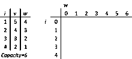
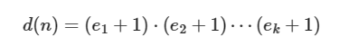
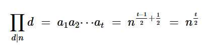

# Competitive-programming
Algoritmos e ideias de Programação Competitiva

Créditos para: [Tiagosf00](https://github.com/Tiagosf00), [Cebolinha](https://quirino.net/).

1. [Competitive-programming](#competitive-programming)
   1. [Linux Alias](#linux-alias)
   2. [Template:](#template)
   3. [Checklist](#checklist)
2. [DP](#dp)
   1. [Bitmask DP](#bitmask-dp)
      1. [Broken Profile](#broken-profile)
   2. [Digit DP](#digit-dp)
   3. [Knapsack](#knapsack)
   4. [LIS ( Longest Increasing Sequence )](#lis--longest-increasing-sequence-)
3. [Flow](#flow)
   1. [Fluxo](#fluxo)
      1. [Minimum Cut](#minimum-cut)
      2. [Matching](#matching)
   2. [Fluxo com custo](#fluxo-com-custo)
   3. [Versao com Djikstra](#versao-com-djikstra)
4. [Game-Theory](#game-theory)
   1. [Nim Game](#nim-game)
      1. [Bouton's Theorem](#boutons-theorem)
      2. [Interpretation as a DAG](#interpretation-as-a-dag)
      3. [Nim with Increases](#nim-with-increases)
      4. [Staircase Nim Example](#staircase-nim-example)
      5. [Sprague-Grundy Theorem](#sprague-grundy-theorem)
      6. [Insta-Winning States](#insta-winning-states)
   2. [MEX](#mex)
5. [Geometry](#geometry)
   1. [Minimum pair distance](#minimum-pair-distance)
   2. [Andrew's monotone chain convex hull algorithm](#andrews-monotone-chain-convex-hull-algorithm)
   3. [Teoria](#teoria)
      1. [Área de qualquer polígono, convexo ou não.](#área-de-qualquer-polígono-convexo-ou-não)
   4. [Lattice Points](#lattice-points)
   5. [Point Struct for 2D](#point-struct-for-2d)
6. [Graph](#graph)
   1. [2-SAT (2-satisfiability)](#2-sat-2-satisfiability)
   2. [Bellman Ford](#bellman-ford)
   3. [Bridges ( Cut Edges )](#bridges--cut-edges-)
   4. [Articulation Points and Bridges](#articulation-points-and-bridges)
   5. [Cycles](#cycles)
   6. [Euler Tour Technique (ETT)](#euler-tour-technique-ett)
   7. [DFS Tree](#dfs-tree)
   8. [Euler Path](#euler-path)
      1. [Hierholzer Algorithm](#hierholzer-algorithm)
   9. [Floyd Warshall](#floyd-warshall)
   10. [Strongly Connected Components](#strongly-connected-components)
       1. [Kosaraju Algorithm](#kosaraju-algorithm)
   11. [Minimum Spanning Tree](#minimum-spanning-tree)
       1. [Kruskal's Algorithm](#kruskals-algorithm)
       2. [Dijkstra](#dijkstra)
       3. [Modified Dijkstra for K-Shortest Paths](#modified-dijkstra-for-k-shortest-paths)
   12. [All-Pairs Shortest Paths (APSP)](#all-pairs-shortest-paths-apsp)
       1. [Floyd Warshall](#floyd-warshall-1)
   13. [Topological Sort](#topological-sort)
7. [Math](#math)
   1. [Center of Tree](#center-of-tree)
   2. [Combinatorics Theory](#combinatorics-theory)
      1. [Lucas' Theorem](#lucas-theorem)
      2. [Stars and Bars](#stars-and-bars)
      3. [Burside Lemma](#burside-lemma)
   3. [Derangement (Desarranjo)](#derangement-desarranjo)
   4. [Divisibility](#divisibility)
      1. [Greatest Common Divisor (GCD)](#greatest-common-divisor-gcd)
      2. [Least Commom Multiple (LCM)](#least-commom-multiple-lcm)
      3. [Closed Formulas related to divisors of a number](#closed-formulas-related-to-divisors-of-a-number)
   5. [Extended Euclidian Algorithm](#extended-euclidian-algorithm)
   6. [Equacao Diofantina Linear](#equacao-diofantina-linear)
   7. [Fast Fourier Transform (FFT)](#fast-fourier-transform-fft)
   8. [Factorization](#factorization)
      1. [Trial Division with precomputed primes](#trial-division-with-precomputed-primes)
      2. [Using Smallest Prime technique](#using-smallest-prime-technique)
      3. [Pollard Rho](#pollard-rho)
   9. [Matrix](#matrix)
      1. [Another Version with LL and MOD](#another-version-with-ll-and-mod)
      2. [Operations with Combinatorics](#operations-with-combinatorics)
      3. [Overloading Operations Struct](#overloading-operations-struct)
   10. [Sieve of Eratóstenes](#sieve-of-eratóstenes)
       1. [Linear Sieve](#linear-sieve)
   11. [Series' Theory](#series-theory)
   12. [Totient](#totient)
   13. [Xor Basis](#xor-basis)
8. [Misc](#misc)
   1. [Getline](#getline)
   2. [Random Numbers Generator](#random-numbers-generator)
9. [Searching-Sorting](#searching-sorting)
   1. [Binary search](#binary-search)
   2. [Merge sort](#merge-sort)
   3. [Policy Based Data Structures (PBDS)](#policy-based-data-structures-pbds)
   4. [Ternary Search](#ternary-search)
10. [Segtree](#segtree)
    1. [Dynamic Segtree](#dynamic-segtree)
    2. [Inverted Segtree](#inverted-segtree)
    3. [Iterative P-sum Classic Segtree with MOD](#iterative-p-sum-classic-segtree-with-mod)
    4. [Iterative Range-Increment Range-Maximum (Lazy)](#iterative-range-increment-range-maximum-lazy)
    5. [Recursive Classic Segtree](#recursive-classic-segtree)
       1. [Clearer version (min-seg)](#clearer-version-min-seg)
       2. [Even more polished (sum-seg):](#even-more-polished-sum-seg)
    6. [Recursive Segtree with Lazy propagation](#recursive-segtree-with-lazy-propagation)
       1. [Most recent version (Max range query, increase range update)](#most-recent-version-max-range-query-increase-range-update)
       2. [Sum range query, increase range update](#sum-range-query-increase-range-update)
       3. [Range Minimum Query, Update (Assignment) Query](#range-minimum-query-update-assignment-query)
       4. [Complex Lazy Problems](#complex-lazy-problems)
    7. [Range increase and set queries](#range-increase-and-set-queries)
    8. [Seg 2d](#seg-2d)
    9. [Implicit Segtree or Sparse Segtree](#implicit-segtree-or-sparse-segtree)
11. [Strings](#strings)
    1. [Aho Cosarick](#aho-cosarick)
       1. [find first occurences of match for each pattern](#find-first-occurences-of-match-for-each-pattern)
       2. [Count how many matches per pattern](#count-how-many-matches-per-pattern)
    2. [Booth's Algorithm](#booths-algorithm)
    3. [Hashing](#hashing)
    4. [KMP algorithm for computing the prefix function](#kmp-algorithm-for-computing-the-prefix-function)
    5. [Manacher's Algorithm](#manachers-algorithm)
    6. [SUFFIX ARRAY](#suffix-array)
       1. [KASAI's ALGORITHM FOR LCP (longest common prefix)](#kasais-algorithm-for-lcp-longest-common-prefix)
    7. [Z-function](#z-function)
12. [Structures](#structures)
    1. [BIT ( Fenwick Tree or Binary indexed tree)](#bit--fenwick-tree-or-binary-indexed-tree)
       1. [1-indexed Implementation](#1-indexed-implementation)
    2. [2-Dimensional Binary Indexed Tree](#2-dimensional-binary-indexed-tree)
    3. [Disjoint Set Union](#disjoint-set-union)
    4. [TRIE](#trie)
13. [Tree](#tree)
    1. [Binary lifting](#binary-lifting)
    2. [Center of Tree](#center-of-tree-1)
    3. [Find the Centroid of a Tree](#find-the-centroid-of-a-tree)
    4. [Centroid Decomposition](#centroid-decomposition)
    5. [Find the Diameter](#find-the-diameter)
       1. [Find the lenght of the longest path from all nodes](#find-the-lenght-of-the-longest-path-from-all-nodes)
    6. [Heavy Light Decomposition (WIP)](#heavy-light-decomposition-wip)
    7. [HLD Second Version](#hld-second-version)


## Linux Alias

```bash
alias comp='g++ -std=c++17 -g3 -ggdb3 -O3 -Wall -Wextra  -fsanitize=address,undefined -Wshadow -Wconversion -D_GLIBCXX_ASSERTIONS -o test'
```

*-Wall -Wextra -Wconversion -Wshadow* shows warnings

*-fsanitize=address,undefined* shows errors for memory access error and undefined behaviour (overflow)

*-g3 -ggdb3* shows more details for compilation errors (line that ocurred error)

## Template:

```cpp
// Needed
#include <bits/stdc++.h>
using namespace std;
#define sws cin.tie(0)->sync_with_stdio(0)

// Life Quality
#define endl '\n'
#define ll long long
#define vll vector<ll>
#define pb push_back
#define ld long double
#define vld vector<ld>
#define pll pair<ll, ll>
#define vpll vector<pll>
#define ff first
#define ss second
#define tlll tuple<ll, ll, ll>

// Utility
#define teto(a, b) ((a+b-1)/(b))
#define LSB(i) ((i) & -(i))
#define MSB(i) (32 - __builtin_clz(i)) // or 64 - clzll
#define BITS(i) __builtin_popcount(i) // count bits

mt19937 rng(chrono::steady_clock::now().time_since_epoch().count());

// Debugging
#define db(a) cerr << " [ " << #a << " = " << a << " ] " << endl;
#define debug(a...) cerr<<#a<<": ";for(auto &b:a)cerr<<b<<" ";cerr<<endl;
template <typename... A> void dbg(A const&... a) { ((cerr << "{" << a << "} "), ...); cerr << endl; }

// Constants
const int MAX = 2e5+10;
const long long MOD = 1e9+7;
const int INF = 0x3f3f3f3f;
const long long LLINF = 0x3f3f3f3f3f3f3f3f;
const long double EPS = 1e-7;
const long double PI = acos(-1);

int32_t main(){ sws;

}
```

## Checklist

**Thinking about solution:**

- Immediately play with the sample cases, you may have understood the problem wrong

- Pay close attention to the constraints

- Always consider doing Binary Search on the answer

- Consider Offline processing

**Before Submitting:**

- Even if the test cases pass, make sure your code is at least doing something

- If the test cases are too simple, come up with a couple extra ones

- Check if constants are big enough

- Check time and memory limits

- Submit the right file

**General:**

- #define int long long

- Fast IO & endl

- Be very careful when copy pasting, check you've changed everything that needs changing

- Be wary of special cases, and when you do define one, be very sure you've correctly identified the full extent of their implications
STL

- Don't call .back(), .front(), .top() on empty containers

- Don't change a container as you iterate through it (Even accessing a map may change it)

- Always make sure your iterators are valid

**Graphs:**

- Add edges both ways if the graph is bidirectional

---

# DP

## Bitmask DP

use a bitmask of chosen itens to be a state of the DP

**Example**:

https://cses.fi/problemset/task/1653/

```cpp
int32_t main(){
    ll n, x; cin >> n >> x;
    vll a(n);

    for(ll i=0; i<n; i++) cin >> a[i];

    // dp[bitmask of selected people] -> {elevator rides, weight occupied}
    vpll dp( (1 << n) , {INF, INF}); 
    dp[0] = {1, 0};

    for(ll mask=0; mask< (1<<n); mask++) {
        for(ll j=0; j<n; j++) {
            if (mask & (1 << j)) {
                ll bit = mask ^ (1 << j);

                // there is room for one more weight
                if (dp[bit].ss + a[j] <= x)
                    dp[mask] = min( dp[mask], {dp[bit].ff, dp[bit].ss + a[j]} );
                
                // add an elevator ride, and create a new one with just one person
                else 
                    dp[mask] = min( dp[mask], {dp[bit].ff + 1, a[j]} );
            }
        }
    }
    cout << dp[(1 << n) - 1].ff << endl;
}
```

### Broken Profile

Solves problem where is needed to count the ways of filling a *n* x *m* grid with dominos/tilings of specific size.

*Example:* Fill *n* x *m* with 2x1 dominos or 1x2 dominos -> https://cses.fi/problemset/task/2181

1 ≤ n ≤ 10 (rows)
1 ≤ m ≤ 1000 (collums)

#### States

**dp[j][p]** -> numbers of ways of filling first *j* columns completely with dominoes (without leaving any block as empty) and leaving the profile *p* for the *j+1* collum.

*j* = collums completely filled.
*p* = bitmask representation of the "profile" for the j+1 collum.

Note that, the (j+1) th column should not contain a complete domino (in the vertical), those types will be included in the dp transition from j+1 to j+2.


#### Transitions

**Initial States:**
```cpp
dp[i = 0][p = 0] = 1
dp[i = 0][p != 0] = 0
```

From a specific **dp[j][q]**, with profile *q* for the *j-th* collum and all the collums before filled, it's possible to generate several **dp[j+1][p]** just by adding vertical and horizontal tiles.

**Final Answer:** dp[m][0]

```cpp
// grid size
ll dp[1010][1 << 11];
ll n, m;
// n is the num of rows, m is the num of collums

// check if i'th bit of q is occupied
bool occupied(ll i, ll q) {
    return q & (1 << (i-1));
}

void solveBlock(ll i, ll j, ll p, ll q) {
    // from profile q -> generate profile p
    // OBS: q represents the profile of the j col, and p represents the profile of the j+1 col when j is filled;
    // i <= 10 (row); j <= 1000 (col)

    // found a new way to fill j, add this possibility
    if (i == n+1) {
        dp[j+1][p] = (dp[j+1][p] + dp[j][q]) % MOD;
        return;
    }

    // skip occupied block
    if ( occupied(i, q) ) {
        solveBlock(i+1, j, p, q);
        return;
    }
    
    // insert vertical tile
    if(i+1 <= n and !occupied(i+1, q)){
        solveBlock(i+2, j, p, q);
    }

    // insert horizontal tile
    if (j+1 <= m) {
        solveBlock(i+1, j, p^(1<<(i-1)), q);
    }
}

int32_t main(){ sws;
    cin >> n >> m;
    memset(dp, 0, sizeof(dp));
    dp[0][0] = 1; // Initial Condition
    for(ll j=0; j<m; j++) { // each collum
        for(ll q=0; q < (1 << n); q++){ // each collum profile
            solveBlock(1, j, 0, q);
        }
    }
    cout << dp[m][0] << endl;
}   
```

## Digit DP

Use each digit position as state and also is the considered number is already smaller than the reference.
The rest of the states are defined by the problem

#### Example1:

Calculate the quantity of numbers with no consective equal digits

```cpp
string s; // number 
ll tab[20][2][2][2][20];

// * returns the qtd of numbers with no consective equal digits
ll dp(ll i, bool smaller, bool consec, bool significantDigit, ll lastDigit){
    if (i >= (ll) s.size()) {
        if (consec) return 0;
        else return 1;
    }
    
    if (tab[i][smaller][consec][significantDigit][lastDigit] != -1)
        return tab[i][smaller][consec][significantDigit][lastDigit];
 
    ll limit = (s[i] - '0');
    ll ans = 0;
    
    for(ll a=0; a<=9; a++){
        bool tmp = consec;
        bool tmp2 = significantDigit; // avoid left zeros: 00001

        if (a > 0) tmp2 = 1;
        if (a == lastDigit and significantDigit) tmp = 1;

        if (smaller){
            ans += dp(i+1, 1, tmp, tmp2, a);
        }
        else if (a < limit){
            ans += dp(i+1, 1, tmp, tmp2, a);
        }
        else if (a == limit){
            ans += dp(i+1, 0, tmp, tmp2, a);
        }
    }
    return tab[i][smaller][consec][significantDigit][lastDigit] = ans;
}


int32_t main(void){ sws;
    ll a, b; cin >> a >> b;

    memset(tab, -1, sizeof(tab));
    s = to_string(b);
    ll ansr = dp(0, 0, 0, 0, 15); // 15 is simply a not valid number

    memset(tab, -1, sizeof(tab));
    s = to_string(a-1);
    ll ansl = dp(0, 0, 0, 0, 15);

    cout << ansr - ansl << endl;
}
```

#### Example2:

Classy numbers are the numbers than contains no more than 3 non-zero digit

```cpp
string s;
ll tab[20][2][5];
 
// * returns qtd of classy numbers 
ll dp(ll i, bool smaller, ll dnn){
    if (dnn > 3) return 0;
    if (i >= s.size()) return 1;
    
    if (tab[i][smaller][dnn] != -1) return tab[i][smaller][dnn];
 
    ll limit = (s[i] - '0');
    ll ans = 0;
 
    for(ll a=0; a<=9; a++){
        ll dnn2 = dnn;
        if (a > 0) dnn2 += 1;
 
        if (smaller){
            ans += dp(i+1, 1, dnn2);
        }
        else if (a < limit){
            ans += dp(i+1, 1, dnn2);
        }
        else if (a == limit){
            ans += dp(i+1, 0, dnn2);
        }
    }
    return tab[i][smaller][dnn] = ans;
}
 
int32_t main(void){ sws;
    ll t; cin >> t;
    while(t--){
        ll l, r;
        cin >> l >> r;
 
        memset(tab, -1, sizeof(tab));
        s = to_string(r);
        ll ansr = dp(0, 0, 0);
 
        memset(tab, -1, sizeof(tab));
        s = to_string(l-1);
        ll ansl = dp(0, 0, 0);
 
        cout << ansr - ansl << endl;
    }
} 
```

## Knapsack



- Use int instead of long long for 10^8 size matrix

```cpp
    int n; cin >> n; // quantity of items to be chosen
    int x; cin >> x; // maximum capacity or weight
    vector<int> cost(n+1);
    vector<int> value(n+1);
    for(int i=1; i<=n; i++) cin >> cost[i];
    for(int i=1; i<=n; i++) cin >> value[i];

    vector<vector<int>> dp(n+1, vector<int>(x+1, 0));

    for(int i=1; i<=n; i++){
        for(int j=1; j<=x; j++){
            // same answer as if using -1 total capacity (n pega)
            dp[i][j] = max(dp[i][j], dp[i-1][j]);
            // use the item with index i (pega)
            if (j-cost[i] >= 0)
                dp[i][j] = max(dp[i][j], dp[i-1][j-cost[i]] + value[i]);
        }
    }

    cout << dp[n][x] << endl;
```

## LIS ( Longest Increasing Sequence )

**Strictly Increasing**: ans_i < ans_(i+1)

**Requires** a vector *x* with size *n*
```cpp
vll d(n+1, LLINF);
d[0] = -LLINF;
for(ll i=0; i<n; i++){
    ll idx = upper_bound(d.begin(), d.end(), x[i]) - d.begin();
    if (d[idx-1] < x[i])
        d[idx] = min(d[idx], x[i]);
}
ll lis = (lower_bound(d.begin(), d.end(), LLINF) - d.begin() - 1);
```


---

# Flow

## Fluxo

**Complexity:** O( Vertices^2 * Edges)

- For unit capacity graph: O( (V+E) sqrt(E) )
- For unit capacity and also Bipartite Graphs: O( (V+E) sqrt(V) )

```cpp
const ll N = 505; // number of nodes, including sink and source

struct Dinic {
    struct Edge { 
        ll from, to, flow, cap;
    };
    vector<Edge> edges;

    vector<ll> g[N];
    ll ne = 0, lvl[N], vis[N], pass;
    ll qu[N], px[N], qt;

    ll run(ll s, ll sink, ll minE) {
        if (s == sink) return minE;
        ll ans = 0;
        for(; px[s] < (int)g[s].size(); px[s]++){
            ll e = g[s][ px[s] ];
            auto &v = edges[e], &rev = edges[e^1];
            if( lvl[v.to] != lvl[s]+1 || v.flow >= v.cap) continue;
            ll tmp = run(v.to, sink, min(minE, v.cap - v.flow));
            v.flow += tmp, rev.flow -= tmp;
            ans += tmp, minE -= tmp;
            if (minE == 0) break;
        }
        return ans;
    }

    bool bfs(ll source, ll sink) {
        qt = 0;
        qu[qt++] = source;
        lvl[source] = 1;
        vis[source] = ++pass;
        for(ll i=0; i<qt; i++) {
            ll u = qu[i];
            px[u] = 0;
            if (u == sink) return 1;
            for(auto& ed :g[u]) {
                auto v = edges[ed];
                if (v.flow >= v.cap || vis[v.to] == pass) continue;
                vis[v.to] = pass;
                lvl[v.to] = lvl[u]+1;
                qu[qt++] = v.to;
            }
        }
        return false;
    }

    ll flow(ll source, ll sink) { // max_flow
        reset_flow();
        ll ans = 0;
        while(bfs(source, sink))
            ans += run(source, sink, LLINF);
        return ans;
    }

    void addEdge(ll u, ll v, ll c, ll rc = 0) { // c = capacity, rc = retro-capacity;
        Edge e = {u, v, 0, c};
        edges.pb(e);
        g[u].pb(ne++);
        e = {v, u, 0, rc};
        edges.pb(e);
        g[v].pb(ne++);
    }

    void reset_flow() {
        for (ll i=0; i<ne; i++) edges[i].flow = 0;
        memset(lvl, 0, sizeof(lvl));
        memset(vis, 0, sizeof(vis));
        memset(qu, 0, sizeof(qu));
        memset(px, 0, sizeof(px));
        qt = 0; pass = 0;
    }

    vector<pll> cut() { // OBS: cut set cost is equal to max flow (number of edges)
        // the cut set is the set of edges that, if removed, will disrupt flow and make it 0.
        vector<pll> cuts;
        for (auto [from, to, flow, cap]: edges)
            if (flow == cap and vis[from] == pass and vis[to] < pass and cap > 0)
                cuts.pb({from, to});
        return cuts;
    }
};
```

#### How to use?

Set an unique id for all nodes

Remember to include the sink vertex and the source vertex. Usually *n+1* and *n+2*, *n* = max number of normal vertices

use **dinic.addEdge** to add edges -> (from, to, normal way capacity, retro-capacity)

use **dinic.flow(source_id, sink_id)** to receive maximum flow from source to sink through the network

### Minimum Cut

Another problem solved by network flow is the **minimum cut**.

Let’s define an **s-t cut C** = *(S-component, T-component)* as a partition of *V ∈ G* such that source *s ∈ S-component* and sink *t ∈ T-component*. Let’s also define a cut-set of C to be the set {(u, v) ∈ E | u ∈ S-component, v ∈ T-component} such that if all edges in the cut-set of C are removed, the Max Flow from s to t is 0 (i.e., s and t are disconnected). The cost of an s-t cut C is defined by the sum of the capacities of the edges in the cut-set of C.

The by-product of computing Max Flow is Min Cut! After Max Flow algorithm stops, we run graph traversal (DFS/BFS) from source s again. All reachable vertices from source s using positive weighted edges in the residual graph belong to the S-component. All other unreachable vertices belong to the T-component. All edges connecting the S-component to the T-component belong to the cut-set of C. The Min Cut value is equal to the Max Flow value mf. This is the minimum over all possible s-t cuts values.

#### Example:

https://cses.fi/problemset/task/1695/

```cpp
int32_t main(){ sws;
    ll n, m; cin >> n >> m;
    Dinic dinic;
    for(ll i=0; i<m; i++) {
        ll u, v; cin >> u >> v;
        dinic.addEdge(u, v, 1, 1);
    }
    dinic.flow(1, n);
    vpll ans = dinic.cut();
    cout << ans.size() << endl;
    for(auto [u, v] : ans) cout << u << ' ' << v << endl;
}   
```

### Matching

A perfect matching includes all vertices from the bipartite graph L and R. 

A maximum matching has the maximum cadinality. A perfect matching is a maximum matching. But the opposite is not necessarity true.

It's possible to access *dinic.edges*, which is a vector that contains all edges and also its respective attributes, like the .flow passing through each edge. Remember to consider that negative flow exist for reverse edges. 

This can be used to **matching problems** with a bipartite graph and *1 capacity* for example.

## Fluxo com custo 

```cpp
struct Edge
{
    int from, to, capacity, cost;
};

vector<vector<int>> adj, cost, capacity;

const int INF = 1e9;

void shortest_paths(int n, int v0, vector<int>& d, vector<int>& p) {
    d.assign(n, INF);
    d[v0] = 0;
    vector<bool> inq(n, false);
    queue<int> q;
    q.push(v0);
    p.assign(n, -1);

    while (!q.empty()) {
        int u = q.front();
        q.pop();
        inq[u] = false;
        for (int v : adj[u]) {
            if (capacity[u][v] > 0 && d[v] > d[u] + cost[u][v]) {
                d[v] = d[u] + cost[u][v];
                p[v] = u;
                if (!inq[v]) {
                    inq[v] = true;
                    q.push(v);
                }
            }
        }
    }
}

int min_cost_flow(int N, vector<Edge> edges, int K, int s, int t) {
    adj.assign(N, vector<int>());
    cost.assign(N, vector<int>(N, 0));
    capacity.assign(N, vector<int>(N, 0));
    for (Edge e : edges) {
        adj[e.from].push_back(e.to);
        adj[e.to].push_back(e.from);
        cost[e.from][e.to] = e.cost;
        cost[e.to][e.from] = -e.cost;
        capacity[e.from][e.to] = e.capacity;
    }

    int flow = 0;
    int cost = 0;
    vector<int> d, p;
    while (flow < K) {
        shortest_paths(N, s, d, p);
        if (d[t] == INF)
            break;

        // find max flow on that path
        int f = K - flow;
        int cur = t;
        while (cur != s) {
            f = min(f, capacity[p[cur]][cur]);
            cur = p[cur];
        }

        // apply flow
        flow += f;
        cost += f * d[t];
        cur = t;
        while (cur != s) {
            capacity[p[cur]][cur] -= f;
            capacity[cur][p[cur]] += f;
            cur = p[cur];
        }
    }

    if (flow < K)
        return -1;
    else
        return cost;
}

```


## Versao com Djikstra

```cpp

template <int MN, int MM>
struct MCF  // MN = nodes, MM = edges [assume edges one-directional]
{
  public:
    int N, M, S, T;
    int flow[MM * 2], cap[MM * 2], hd[MN], nx[MM * 2], to[MM * 2], cost[MM * 2];
    int pi[MN], p[MN], d[MN];
    int vis[MN];
    void init(int n, int s, int t) {
        N = n, S = s, T = t;
        memset(hd, -1, sizeof hd);
    }
    void adde1(int a, int b, int f, int c) {
        nx[M] = hd[a], hd[a] = M;
        to[M] = b, cost[M] = c, cap[M] = f;
        M++;
    }
    void adde(int a, int b, int f, int c) {
        adde1(a, b, f, c);
        adde1(b, a, 0, -c);
    }
    void setpi() {
        std::queue<int> q;
        memset(pi, 0x3e, sizeof pi);
        memset(vis, 0, sizeof vis);
        q.push(S);
        pi[S] = 0;
        for (int n; !q.empty();) {
            n = q.front();
            q.pop();
            for (int id = hd[n], x; ~id; id = nx[id]) {
                if (cap[id] - flow[id] <= 0) continue;
                x = to[id];
                if (ckmin(pi[x], pi[n] + cost[id]))
                    assert(++vis[x] <= N), q.push(x);
            }
        }
    }
    struct state {
      public:
        int n, d;
        bool operator>(state o) const { return d > o.d; }
    };
    void dijk() {
        std::priority_queue<state, std::vector<state>, std::greater<state>> q;
        memset(p, -1, N * sizeof p[0]);
        memset(vis, 0, N * sizeof vis[0]);
        memset(d, 0x3e, N * sizeof d[0]);

        d[S] = 0;
        q.push({S, 0});
        for (int n; !q.empty();) {
            n = q.top().n;
            q.pop();
            if (vis[n]) continue;
            vis[n] = 1;
            for (int id = hd[n], x, w; ~id; id = nx[id]) {
                if (cap[id] - flow[id] <= 0) continue;
                x = to[id];
                w = cost[id] + pi[n] - pi[x];
                if (ckmin(d[x], w + d[n])) p[x] = id, q.push({x, d[x]});
            }
        }
    }
    int mincost(int F) {
        setpi();
        int C = 0;
        while (F > 0) {
            dijk();
            if (d[T] == INF) return INF;
            int c = d[T] + pi[T] - pi[S], f = F;
            for (int x = T; x != S; x = to[p[x] ^ 1])
                ckmin(f, cap[p[x]] - flow[p[x]]);
            C += c * f;
            for (int x = T; x != S; x = to[p[x] ^ 1]) {
                flow[p[x]] += f;
                flow[p[x] ^ 1] -= f;
            }
            F -= f;
            for (int i = 0; i < N; ++i) pi[i] += d[i];
        }
        return C;
    }
};

```


---

# Game-Theory

## Nim Game

**References:** 

https://cp-algorithms.com/game_theory/sprague-grundy-nim.html

https://codeforces.com/blog/entry/66040

- There are *n* piles (heaps), each one with *x_i* stones. 

- Each turn, a players must remove *t* stones (non-zero) from a pile, turning *x_i* into *y_i*. 

- The game ends when it's impossible to make any more moves and the player without moves left lose.

### Bouton's Theorem

"Let *s* be the *xor-sum* value of all the piles sizes, a state **s=0** is a losing position and a **state s!=0** is a winnig position".

#### Proof

- When *s=0*, a move reduces a pile with size x to y (y < x). 

        t = s xor x xor y = 0 xor x xor y = x xor y
    
        (y < x) 
        => t = (x xor y) != 0 (valid move)
        => s' != s 
        => s' != 0. 
        => becomes a wining state
        => was a losing state

- When *s!=0*, there is at least one pile x, with the *d* bit set. d is the msb bit of s.

        reduce this pile x to y, consider y = x xor s

        (x xor s <= x) and (s != 0)
        => y = (x xor s) < x
        => valid move

        t = s xor x xor y = s xor x xor (x xor s) = 0

### Interpretation as a DAG

States of the game are Vertices

Moves are the transition between States, therefore, the Edges

If a State has no outgoing edges, it's a dead end and a losing state

### Nim with Increases

Consider a modification of the classical nim game: a player can now add stones to a chosen pile. This extra rule needs to keep the game acyclic (finite game).

**Lemma:** This move is not used in a winnig strategy and can be ignored when computing if a state is winning.

**Proof:** If a player adds *t* stones in a pile, the next player just needs to remove *t* stones from this pile. Considering that the game is finite and ends sooner or later.

### Staircase Nim Example

In Staircase Nim, there is a staircase with n steps, indexed from 0 to n - 1. In each step, there are zero or more coins.

Two players play in turns. In his/her move, a player can choose a step i > 0 and move one or more coins to step i - 1. The player who is unable to make a move lose the game. That means the game ends when all the coins are in step 0.

We can divide the steps into two types, odd steps, and even steps. 

Now let's think what will happen if a player A move *x* coins from an even step(non-zero) to an odd step. Player B can always move these same *x* coins to another even position and the state of odd positions won't change: 

=> Odd_Xor_Sum' = Odd_Xor_Sum

But if player A moves a coin from an odd step to an even step, similar logic won't work. Because there is a situation when *x* coins are moved from stair 1 to 0, and player B can't move these coins from stair 0 to -1 (not a valid move). Also, position 0 is the void, sending elements there is the same as decreasing the pile 1.

From this argument, we can agree that coins in even steps are useless, they don't affect the game state and we can consider them as void positions. Furthermore, when only considering odd positions, there is a normal classic nim game (each pile can be decreasced = move to even position = move to void).

If I am in a winning position and you move a coin from an even step, I will move those coins again to another even step and I will remain in a winning position. The same applies for the losing positions.

Therefore, to determine if a state is a winning position or losing position, it's only needed to compute the xor-sum of the odd positions.

### Sprague-Grundy Theorem

Let's consider a state *v* of a two-player impartial game and let *v_i* be the states reachable from it (where $i \in \{ 1, 2, \dots, k \} , k \ge 0$ ). 

To this state, we can assign a fully equivalent game of Nim with one pile of size *x*. The number *x* is called the *Grundy value or nim-value or nimber* of the state *v*.

If *all transitions* lead to a **winning state**, the current state must be a **losing state**.

If *at least one transition* lead to a **losing state**, the current state must be a **winning state**.

The MEX operator satisfies both condition above and can be used to calculate the nim-value of a state:

$$ x = \text{mex}\ \{ x_1, \ldots, x_k \}, $$ 

where *x_i* is the Grundy value for state *v_i* and the function MEX is the smallest non-negative integer not found in the given set.

Viewing the game as a graph, we can gradually calculate the Grundy values starting from vertices without outgoing edges. Grundy value being equal to zero means a state is losing.

Note that the MEX operation **garantees** that all nim-values smaller than the considered nimber can be reached, which is essentialy the nim game. 

#### Application

To calculate the Grundy value of a given state you need to:

    Get all possible transitions from this state

    Each transition can lead to a sum of independent games (one game in the degenerate case). Calculate the Grundy value for each independent game and xor-sum them. Of course xor does nothing if there is just one game.

    After we calculated Grundy values for each transition we find the state's value as the MEX of these numbers.

    If the value is zero, then the current state is losing, otherwise it is winning.

**Composition:** Use XOR to compose sub-games into a game.

When a game is played with multiple sub-games (as nim is played with multiple piles), you are actually choosing one sub-game and making a valid move there (choosing a pile and subtracting a value from it).

**Decomposition:** Use MEX on all posible state outcomes.

A single pile with size *x* can be transitioned into all nim-values smaller than *x*. Therefore, the inverse interpretation is simply the MEX. 

If the set of possible outcomes is {0, 1, 2, 7, 8, 9}. The MEX is 3, because is the smallest nim-value which you can't transition into and also you can transition to all smaller nim-values. Also, {7, 8, 9} transitions can be ignored, because you can simply revert the play by subtracting the same amount.

#### Example

**Grundy's Game:**

Initially there is only one pile with *x* stones. Each turn, a player must divide a pile into two non-zero piles with different sizes. The player who can't do any more moves loses.

*Important observation*: All nimbers for (n >= 2000) are non-zero. (missing proof here).

**Degenerate (Base) States:**

*x = 1* (nim-val = 0) (losing)

*x = 2* (nim-val = 0) (losing)

**Other States:**

nim-val = MEX (all transitions)

*(x = 3):*

    {2, 1} -> (0) xor (0) -> 0

    nim-val = MEX({0}) = 1

*(x = 4):*

    {3, 1} -> (1) xor (0) -> 1

    nim-val = MEX({1}) = 0

*(x = 5):*

    {4, 1} -> (0) xor (0) -> 0
    {3, 2} -> (1) xor (0) -> 1

    nim-val = MEX({0, 1}) = 2

*(x = 6):*

    {5, 1} -> (2) xor (0) -> 2
    {4, 2} -> (0) xor (0) -> 0

    nim-val = MEX({0, 2}) = 1

### Insta-Winning States

Classic nim game: if all piles become 0, you lose. (no more moves)
Modified nim game: if any pile becomes 0, you lose.

To adapt to this version of nim game, we create *insta-winning states*, which represents states that have a transition to a empty pile. *Insta-winning states* must have a very high nimber (INF) so they don't conflict with other nimbers.

Because of this adaptation, we can ignore states with empty piles (null value). And the nimber = 0 now represents the states that only have transitions to *insta-winning states*.

After this, we added two new categories of states (insta-winning and empty-pile). Notice that:

    empty-pile <- insta-winning <- nimber(0)

Therefore, we have returned to the classical nim game and can proceed normally.

*OBS:* Empty piles (wasn't empty before) (nimber = -1) != Non-existent piles (never existed) (nimber = 0)

*Usage Example:* https://codeforces.com/gym/101908/problem/B

## MEX

```cpp
struct MEX {
    map<ll, ll> freq;
    set<ll> missing;

    MEX(ll max_val) { // O(n log(n))
        for(ll i=0; i<=max_val; i++)
            missing.insert(i);
    }

    ll get() { // O(1)
        if (missing.empty()) return 0;
        return *missing.begin();
    }

    void remove(ll val) { // O(log(n))
        freq[val]--;
        if (freq[val] == 0)
            missing.insert(val);
    }

    void add(ll val) { // O(log(n))
        freq[val]++;
        if (missing.count(val))
            missing.erase(val);
    }
};
```


---

# Geometry

## Minimum pair distance

Using **Divide and conquer**, it's possible to split the vector of points into two parts and solve each one separately. When merging, it's sufficient to compare only the *6* closest points for each point which is inside a delimited section. This section is defined by all points between *median.x-d* and *median.x+d*. *d* is the minimum distance of the two parts.  

```cpp
// xs = points sorted by X; ys = points sorted by Y
ll solve(vector<P> xs, vector<P> ys){ // -> O(n log2(n) )
    ll n = xs.size();
    
    // Base case, brute force
    if(n <= 3){
        ll d = xs[0].dist(xs[1]);
        for(ll i=0; i<n; i++)
            for(ll j=i+1; j<n; j++)
                d = min(d, xs[i].dist(xs[j]));
        return d;
    }
    
    // Divide
    ll mid = n/2;
    P median = xs[mid];
    vector<P> xsl(xs.begin(), xs.begin() + mid);
    vector<P> xsr(xs.begin() + mid, xs.end());

    vector<P> ysl, ysr;
    for(auto p : ys){
        if(p.x <= median.x) 
            ysl.push_back(p);
        else 
            ysr.push_back(p);
    }
 
    ll dl = solve(xsl, ysl);
    ll dr = solve(xsr, ysr);

    // Merge !!!
    ll d = min(dl, dr);
 
    vector<P> possible;
    for(auto p : ys){
        if(median.x-d < p.x and p.x < median.x+d)
            possible.push_back(p);
    }
 
    ll m = possible.size();
    for(ll i=0; i<m; i++){
        for(ll j=1; (j<=6 and j+i<m); j++){
            d = min(d, possible[i].dist(possible[i+j]));
        }
    }
 
    return d;
}

bool cmp_by_Y(P a, P b) { 
    return (eq(a.y, b.y) ? a.x < b.x : a.y < b.y); 
}
```

## Andrew's monotone chain convex hull algorithm

**Complexity:** O(n * log (n))

```cpp
vector<P> convex_hull(vector<P>& v){
    vector<P> hull;
    sort(v.begin(), v.end()); // sort by x, then by y
    for(ll rep=0; rep<2; rep++){ // top part, then, bottom part 
        ll old_size = hull.size();
        for(P next : v){
            while(hull.size() - old_size >= 2){
                P prev = hull.end()[-2]; // hull[size - 2]
                P mid = hull.end()[-1]; // hull[size - 1]
                if(prev.cross(mid, next) <= 0) // 0 collinear, <0 mid on the left of next
                    break;
                hull.pop_back(); // stack behaviour
            }
            hull.push_back(next);
        }
        hull.pop_back();
        reverse(v.begin(), v.end());
    }
    return hull;
}
```


## Teoria

Por definição, o produto escalar define o cosseno entre dois vetores:

cos(a, b) = ( a * b ) / ( ||a|| * ||b|| )

a * b =  cos(a, b) * ( ||a|| * ||b|| )

O sinal do produto vetorial de A com B indica a relação espacial entre os vetores A e B.

cross(a, b) > 0 -> ***B*** está a esquerda de ***A***.

cross(a, b) = 0 -> ***B*** é colinear ao ***A***.

cross(a, b) > 0 -> ***B*** está a direita de ***A***.

A magnitude do produto vetorial de A com B é a área do paralelogramo formado por A e B. Logo, a metade é a área do triângulo formado por A e B.

### Área de qualquer polígono, convexo ou não.

Definindo um vértice como 0, e enumerando os demais de [1 a N), calcula-se a área do polígono como o somatório da metade de todos os produtos vetorias entre o 0 e os demais.

```
For i in [1, N) :
    Area += v0 ^ vi
Area = abs(Area)
```

*Lembre-se* de pegar o módulo da área para ignorar o sentido escolhido.

## Lattice Points

*Boundary points:* Use gcd( abs(a.x, b.x), abs(a.y, b.y) ) for each pair of adjacent points.  

*Interior points:* Use Pick's Theorem: 
```
Area_of_polygon = interior_points + boundary_points/2 - 1
```

## Point Struct for 2D

ld behaviour not tested!

```cpp
typedef ll unit;
bool eq(unit a, unit b){ return abs(a - b) <= EPS; }

struct P {
    unit x, y;
    P(unit xx=0, unit yy=0): x(xx), y(yy){}
    P operator +(const P& b) const { 
        return P{x + b.x, y + b.y}; 
    }
    P operator -(const P& b) const { 
        return P{x - b.x, y - b.y};
    }
    P operator *(unit t) const {
        return {x*t, y*t};
    }
    P operator /(unit t) const { 
        return {x/t, y/t}; 
    }
    unit operator *(const P& b) const { 
        return x*b.x + y*b.y; 
    }
    unit operator ^(const P& b) const {
        return x*b.y - y*b.x;
    }
    bool operator <(const P& b) const {
        return (eq(x, b.x) ? y < b.y : x < b.x);
    }
    bool operator ==(const P& b) const {
        return eq(x, b.x) and eq(y, b.y);
    }
    unit dist(P b) {
        return ((x-b.x)*(x-b.x) + (y-b.y)*(y-b.y));
    }
    unit dot(const P& b, const P& c) const{
        return (b-*this) * (c-*this);
    }
    unit cross(const P& b, const P& c) const{
        return (b-*this) ^ (c-*this);
    }
};
```


---

# Graph

## 2-SAT (2-satisfiability)

SAT (Boolean satisfiability problem) is NP-Complete.

2-SAT is a restriction of the SAT problem, in 2-SAT every clause has exactly two literals.

Can be solved with graphs in *O(Vertices + Edges)*.

```cpp
// 0-idx graph !!!!
struct TwoSat {
    ll N; // needs to be the twice of the number of variables
    // node with idx 2x => variable x
    // node with idx 2x+1 => negation of variable x

    vector<vll> g, gt; 
    // g = graph; gt = transposed graph (all edges are inverted)

    TwoSat(ll n) { // number of variables
        N = 2*n;
        g.assign(N, vll());
        gt.assign(N, vll());
    }

    vector<bool> used;
    vll order, comp;
    vector<bool> assignment;
    //  assignment[x] == 1 -> x was assigned 
    //  assignment[x] == 0 -> !x was assigned 

    // dfs1 and dfs2 are part of kosaraju algorithm
    void dfs1(ll u) {
        used[u] = true;
        for (ll v : g[u]) if (!used[v]) dfs1(v); 
        order.pb(u); // topological order
    }

    void dfs2(ll u, ll timer) {
        comp[u] = timer;
        for (ll v : gt[u]) if (comp[v] == -1) dfs2(v, timer); 
    }

    bool solve_2SAT() {
        order.clear();
        used.assign(N, false);
        for (ll i = 0; i < N; i++) if (!used[i]) dfs1(i);

        comp.assign(N, -1);
        for (ll i = 0, j = 0; i < N; i++) {
            ll u = order[N - i - 1]; // reverse order
            if (comp[u] == -1) dfs2(u, j++);
        }

        assignment.assign(N/2, false);
        for (ll i = 0; i < N; i += 2) {
            if (comp[i] == comp[i + 1]) return false; // x and !x contradiction
            assignment[i / 2] = comp[i] > comp[i + 1];
        }
        return true;
    }

    void add_disjunction(ll a, bool flagA, ll b, bool flagB) {
        // disjunction of (a, b) => if one of the two variables is false, then the other one must be true
        // a and b can't be false at the same time

        // flagA and flagB represents whether a and b are negated 
        // flagA == 1 => a ; flagA == 0 => !a
        // flagB == 1 => b ; flagB == 0 => !b
        a = 2*a ^ (!flagA);
        b = 2*b ^ (!flagB);
        ll neg_a = a ^ 1;
        ll neg_b = b ^ 1;
        g[neg_a].pb(b);
        g[neg_b].pb(a);
        gt[b].pb(neg_a);
        gt[a].pb(neg_b);
    }
};
```

#### Example of Application:

https://cses.fi/problemset/task/1684/ (Giant Pizza)

```cpp
int32_t main(){ sws;
    ll m, n; cin >> m >> n;
 
    TwoSat twoSat(n);
 
    for(ll i=0; i<m; i++) {
        char charA, charB;
        ll a, b;
        cin >> charA >> a >> charB >> b;
        // at least one => (!a 'disjoint' !b)
        bool na = (charA == '-');
        bool nb = (charB == '-');
        twoSat.add_disjunction(a-1, na, b-1, nb);
    }
 
    if (!twoSat.solve_2SAT()) cout << "IMPOSSIBLE" << endl;
    else {
        for(ll i=0; i<n; i++) {
            if (twoSat.assignment[i]) cout << "+ ";
            else cout << "- ";
        }
        cout << endl;
    }
}   
```

## Bellman Ford

The Bellman–Ford algorithm1 finds shortest paths from a starting node to all nodes of the graph. The algorithm can process all kinds of graphs, provided that the graph does not contain a cycle with negative length. If the graph contains a negative cycle, the algorithm can detect this. To find it, run onde more time.

```cpp

for (int i = 1; i <= n; i++) distance[i] = INF;
    distance[x] = 0;
    for (int i = 1; i <= n-1; i++) {
        for (auto e : edges) {
            int a, b, w;
            tie(a, b, w) = e;
            distance[b] = min(distance[b], distance[a]+w);
        }
}

```

## Bridges ( Cut Edges )

Also called *isthmus* or *cut arc*.

**Theory:** After constructing a DFS Tree, an edge (u, v) is a bridge if and only if there is no back-edge from *v, or a descendent of v,* to *u, or an ancestor of u*.

To do this efficiently, it's used *tin[i] (entry time of node **i**)* and *low[i] (minimum entry time of all nodes that can be reached from node **i**)*.

```cpp
vector<vll> g(MAX, vll());
bool vis[MAX];
ll tin[MAX], low[MAX];
ll timer;
vpll bridges;

void dfs(ll u, ll p = -1){
    vis[u] = 1;
    tin[u] = low[u] = timer++;
    for(auto v : g[u]) if (v != p) {
        if (vis[v]) low[u] = min(low[u], tin[v]);
        else {
            dfs(v, u);
            low[u] = min(low[u], low[v]);
            if (low[v] > tin[u])
                bridges.pb( {u, v} );
        }   
    }
}

void find_bridges(ll n) {
    timer = 1;
    memset(vis, 0, sizeof(vis));
    memset(tin, 0, sizeof(tin));
    memset(low, 0, sizeof(low));
    for(ll i=1; i<=n; i++) if (!vis[i]) dfs(i);
}
```

## Articulation Points and Bridges

Finds all Cut-Vertices and Cut-Edges in a single dfs tranversal O(V+E)

**Maybe is working, maybe it's not, needs testing for exquisite graphs, like cliques**

```cpp
vector<vll> g(MAX, vll());
vll tin(MAX, -1), low(MAX, 0);
// tin[] = the first time a node is visited ("time in")
// if tin[u] != -1, u was visited
// low[] = lowest first_time of any node reachable by the current node

ll root = -1, rootChildren = 0, timer = 0;
// root = the root of a dfs transversal, rootChildren = number of direct descedentes of the root

vector<bool> isArticulation(MAX, 0); // this vector exists, because we can define several time if a node is a cut vertice
vll articulations; // cut vertices
vpll bridges; // cut edges

void dfs(ll u, ll p) {
    low[u] = tin[u] = timer++;

    for(auto v : g[u]) if (v != p) {
        if (tin[v] == -1) { // not visited
            if (u == root) rootChildren += 1;

            dfs(v, u);

            if (low[v] >= tin[u]) isArticulation[u] = 1;
            if (low[v] > tin[u]) bridges.pb({u, v});
        }

        low[u] = min(low[u], low[v]);
    }
}

void findBridgesAndPoints(ll n) {
    timer = 0;
    for(ll i=1; i<=n; i++) if (tin[i] == -1) {
        root = i; rootChildren = 0;
        dfs(i, -1);
        if (rootChildren > 1) isArticulation[i] = 1;
    }
    for(ll i=1; i<=n; i++) if (isArticulation[i]) articulations.pb(i);
}
```

## Cycles

**How to find a cycle:**

*vis[] array* stores the current state of a node:
**-1** -> not visited
**0** -> explored, not ended (still need to end edge transversals)
**1** -> visited, totally explored (no more edges to transverse)

*p[] array* stores the descedent of each node, to reconstruct cycle components

```cpp
vector<vll> g(MAX, vll());
vll vis(MAX, -1);
vll p(MAX, -1);
ll cycle_end, cycle_start;

bool dfs(ll u) {
    vis[u] = 0;
    for(auto v : g[u]) if (vis[v] != 1) {
        if (vis[v] == 0){
            cycle_end = u;
            cycle_start = v;
            return 1;
        }
        p[v] = u;
        if (dfs(v)) return 1;
    }
    vis[u] = 1;
    return 0;
}

bool find_first_cycle(ll n) {
    for(ll i=1; i<=n; i++) if (vis[i] == -1) {
        if (dfs(i)){
            stack<ll> ans;
            ans.push(cycle_start);

            ll j = cycle_end;
            while(j != cycle_start){
                ans.push(j);
                j = p[j];
            }
            ans.push(cycle_start);

            cout << ans.size() << endl;
            while(!ans.empty()){
                cout << ans.top() << ' ';
                ans.pop();
            }
            cout << endl;
            return 1;
        }
    }
    return 0
}
```

## Euler Tour Technique (ETT)

**AKA**: Preorder time , DFS time.

Flattening a tree into an array to easily query and update subtrees. This is achieved by doing a *Pre Order Tree Transversal:* (childs -> node), a simple *dfs* marking *entry times* and *leaving times*.

Creates an array that can have some properties, like all child vetices are ordered after their respective roots.

```cpp
vector<vector<int>> g(MAX, vector<int>());
int timer = 1; // to make a 1-indexed array
int st[MAX]; // L index
int en[MAX]; // R index

void dfs_time(int u, int p) {
	st[u] = timer++;
	for (int v : g[u]) if (v != p) {
        dfs_time(v, u);
	}
	en[u] = timer-1;
}
```

#### Problems

https://cses.fi/problemset/task/1138 -> change value of node and calculate sum of the path to root of a tree

## DFS Tree

A *Back Edge* existence means that there is a cycle.

```cpp
bool visited[MAX];
vector<vll> g(MAX, vll());
map<ll, ll> spanEdges;
map<ll, ll> backEdges; // children to parent
ll h[MAX];
ll p[MAX];

void dfs(ll u=1, ll parent=0, ll layer=1){
    if (visited[u]) return;
    visited[u] = 1;
    h[u] = layer;
    for(auto v : g[u]){
        if (v == parent) spanEdges[u] = v;
        else if (visited[v] and h[v] < h[u]) backEdges[u] = v; 
        else dfs(v, u, layer+1);
    }
}
```

## Euler Path

#### Definitions:

An **Eulerian Path** or **Eulerian Trail** (*Caminho Euleriano*) consists of a path that transverses all **Edges**. 

A special case is the closed path, which is an **Eulerian Circuit** or **Eulerian Cycle** (*Circuito/Ciclo Euleriano*). A graph is considered *eulerian* (**Eulerian Graph**) if it has an Eulerian Circuit.

Similarly, a **Hamiltonian Path** consists of a path that transverses all **Vertices**.

#### Conditions for Eulerian Path existence

To check if it is possible, there is a need for connectivity: 

**connectivity**, all vertices (that contains at least 1 edge) are connected. But there is no need for it to be strongly connected. To check connectivity, you can consider a directed graph as undirected and do a dfs.

and also:


### Hierholzer Algorithm

Find a **Eulerian Path/Circuit** with a linear complexity of *O(Edges)*.

Using an *ordered set* on **Undirected Graphs** increases complexity by *log2(Edges)*. This can be optimized using a *list* with references to each bidirectional edge so that any reversed edge can be erased in *O(1)*.

#### Example 1:

Generating an **Eulerian Path** with Hierholzer in a *Directed Graph*, starting on node *1* and ending on node *n*.

https://cses.fi/problemset/task/1693

```cpp
vector<vll> g(MAX, vll());
vector<vll> ug(MAX, vll()); // undirected graph

vll inDegree(MAX, 0);
vll outDegree(MAX, 0);

vector<bool> vis(MAX, 0);

ll dfsConnected(ll u) {
    ll total = 1; vis[u] = 1;
    for(auto v : ug[u]) if (!vis[v]) {
        total += dfsConnected(v);
    }
    return total;
}

// O(n) -> O(Vertices)
bool checkPossiblePath(ll start, ll end, ll n, ll nodes) {

    // check connectivity
    vis.assign(n+1, 0);
    ll connectedNodes = dfsConnected(1);
    if (connectedNodes != nodes) return 0;

    // check degrees
    for(ll i=1; i<=n; i++) {
        if (i == start) { // start node needs to have 1 more outDegree than inDegree
            if (inDegree[i]+1 != outDegree[i]) return 0;
        }
        else if (i == end) { // end node needs to have 1 more inDegree than outDegree
            if (inDegree[i] != outDegree[i]+1) return 0;
        }
        else {
            if (inDegree[i] != outDegree[i]) return 0;
        }
    }

    return 1;
}

// O(m) -> O(Edges)
// Hierholzer function can be used directly if there is already a garanted existance of an eulerian path/circuit.
vll hierholzer(ll start, ll n) { // generate an eulerian path, assuming there is only 1 end node
    vll ans, pilha, idx(n+1, 0);

    pilha.pb(start);
    while(!pilha.empty()) {
        ll u = pilha.back();
        if (idx[u] < (ll) g[u].size()) {
            pilha.pb( g[u][idx[u]] );
            idx[u] += 1;
        }
        else { // no more outEdge from node u, backtracking
            ans.pb(u);
            pilha.pop_back();
        }
    }
    reverse(ans.begin(), ans.end());
    return ans;
}

int32_t main(){ sws;
    ll n, m; cin >> n >> m;

    // OBS: some nodes are isolated and don't contribute to the eulerian path
    ll participantNodes = 0;

    for(ll i=0; i<m; i++) {
        ll a, b; cin >> a >> b;

        g[a].pb(b);
        ug[a].pb(b); ug[b].pb(a);

        outDegree[a] += 1;
        inDegree[b] += 1;

        if (!vis[a]) {
            vis[a] = 1;
            participantNodes += 1; 
        }
        if (!vis[b]) {
            vis[b] = 1;
            participantNodes += 1; 
        }
    }

    if ( !checkPossiblePath(1, n, n, participantNodes) ) {
        cout << "IMPOSSIBLE" << endl;
        return 0;
    }

    for(auto elem : hierholzer(1, n)) cout << elem << ' ';
    cout << endl;
}   
```

#### Example 2:

Generating an **Eulerian Circuit** with Hierholzer in an *Undirected Graph*, starting on node *1* and also ending on node *1*.

https://cses.fi/problemset/task/1691

```cpp
// adding log2(m) complexity due to ordered_set structure required for not using a same bidirectional edge twice
#include <bits/extc++.h>
using namespace __gnu_pbds;
template <class T> using ordered_set = tree<T, null_type, less<T>, rb_tree_tag, tree_order_statistics_node_update>;

vector<ordered_set<ll>> g(MAX, ordered_set<ll>()); // undirected graph

vll degree(MAX, 0);

vector<bool> vis(MAX, 0);

ll dfsConnected(ll u) {
    ll total = 1; vis[u] = 1;
    for(auto v : g[u]) if (!vis[v]) {
        total += dfsConnected(v);
    }
    return total;
}

// O(n log2(m)) -> O(Vertices * log2(Edges))
bool checkPossiblePath(ll n, ll nodes) {

    // check connectivity
    vis.assign(n+1, 0);
    ll connectedNodes = dfsConnected(1);
    if (connectedNodes != nodes) return 0;

    // check degrees
    for(ll i=1; i<=n; i++) {
        // all degrees need to be even
        if (degree[i] % 2 == 1) return 0;
    }

    return 1;
}

// O(m * log2(m)) -> O(Edges * log2(m)) 
// Hierholzer function can be used directly if there is already a garanted existance of an eulerian path/circuit.
vll hierholzer(ll start, ll n) { // generate an eulerian path, assuming there is only 1 end node
    vll ans, pilha, idx(n+1, 0);

    pilha.pb(start);
    while(!pilha.empty()) {
        ll u = pilha.back();
        if (idx[u] < (ll) g[u].size()) {
            ll v = *(g[u].find_by_order(idx[u]));
            
            pilha.pb( v );
            g[v].erase(u);

            idx[u] += 1;
        }
        else { // no more outEdge from node u, backtracking
            ans.pb(u);
            pilha.pop_back();
        }
    }
    reverse(ans.begin(), ans.end());
    return ans;
}

int32_t main(){ sws;
    ll n, m; cin >> n >> m;

    // OBS: some nodes are isolated and don't contribute to the eulerian circuit
    ll participantNodes = 0;

    for(ll i=0; i<m; i++) {
        ll a, b; cin >> a >> b;

        g[a].insert(b);
        g[b].insert(a);

        degree[a] += 1;
        degree[b] += 1;

        if (!vis[a]) {
            vis[a] = 1;
            participantNodes += 1; 
        }
        if (!vis[b]) {
            vis[b] = 1;
            participantNodes += 1; 
        }
    }

    if ( !checkPossiblePath(n, participantNodes) ) {
        cout << "IMPOSSIBLE" << endl;
        return 0;
    }

    for(auto elem : hierholzer(1, n)) cout << elem << ' ';
    cout << endl;
}   
```


## Floyd Warshall

The Floyd–Warshall algorithm provides an alternative way to approach the problem of finding shortest paths. Unlike the other algorithms of this chapter, it finds all shortest paths between the nodes in a single run.

```cpp

for (int i = 1; i <= n; i++) {
        for (int j = 1; j <= n; j++) {
           if (i == j) distance[i][j] = 0;
           else if (adj[i][j]) distance[i][j] = adj[i][j];
           else distance[i][j] = INF;
} }

for (int k = 1; k <= n; k++) {
        for (int i = 1; i <= n; i++) {
           for (int j = 1; j <= n; j++) {
               distance[i][j] = min(distance[i][j],distance[i][k]+distance[k][j]);
   } }
}

```

## Strongly Connected Components

### Kosaraju Algorithm

Used for **Finding Strongly Connected Somponents** (SCCs) in a *directed graph* (digraph).

**Complexity** O(1) -> O(V + E), linear on number of edges and vertices.

**Remember** to also construct the inverse graph (*gi*).

```cpp
vector<vll> g(MAX, vll());
vector<vll> gi(MAX, vll()); // inverted edges
bool vis[MAX]; // visited vertice?
ll component[MAX]; // connected component of each vertice
stack<ll> pilha; // for inverting order of transversal

void dfs(ll u) {
    vis[u] = 1;
    for(auto v : g[u]) if (!vis[v]) dfs(v);
    pilha.push(u);
}

void dfs2(ll u, ll c) {
    vis[u] = 1; component[u] = c;
    for(auto v : gi[u]) if (!vis[v]) dfs2(v, c);
}

// 1 - idx
void kosaraju(ll n){
    memset(vis, 0, sizeof(vis));
    for(ll i=1; i<=n; i++) if (!vis[i]) dfs(i);

    memset(vis, 0, sizeof(vis));
    memset(component, 0, sizeof(component));
    
    while(!pilha.empty()) {
        ll u = pilha.top(); pilha.pop();
        if (!vis[u]) dfs2(u, u);
    }
}
```

#### Can be extended to generate a Condensation Graph

*AKA:* condensate/convert all SCC's into single vertices and create a new graph

```cpp
vector<vll> gc(MAX, vll()); // Condensation Graph

void condensate(ll n){
    for(ll u=1; u<=n; u++)
        for(auto v : g[u]) if (component[v] != component[u])
            gc[ component[u] ].pb( component[v] );
}
```


## Minimum Spanning Tree

MST minimizes the maximum edge of a tree (considering all possible trees).

### Kruskal's Algorithm

Sort all edges in crescent order by weight, include all edges which joins two disconnected trees. In case of tie, choose whichever. Don't include edges that will join a already connected part of the tree.

```cpp
// use DSU struct
struct DSU{};

set<tlll> edges;

int32_t main(){ sws;
    ll n, m; cin >> n >> m;
    DSU dsu(n+1);
    for(ll i=0; i<m; i++) {
        ll u, v, w; cin >> u >> v >> w;
        edges.insert({w, u, v});
    }
    ll minCost = 0;
    for(auto [w, u, v] : edges) {
        if (dsu.find(u) != dsu.find(v)) {
            dsu.join(u, v);
            minCost += w;
        }
    }
    cout << minCost << endl;
}   
``


## Single-Source Shortest Paths (SSSP)

### Bellman-Ford for shortest paths

**Supports** Negative edges!

**Solves:** Finds all shortest paths from a initial node *x* to every other node

**Complexity:** O(n * m) = O(vertices * edges) -> O(n^2) "quadratic"

**Conjecture:** After **at most** *n-1 (Vertices-1) iterations*, all shortest paths will be found.

```cpp
#define tlll tuple<ll, ll, ll>
vector<tlll> edges(MAX, tlll() );
vll d(MAX, INF);

void BellmanFord(ll x, ll n) {
    d[x] = 0;
    for(ll i=0; i<n-1; i++) { // n-1 iterations will suffice 
        for(auto [u, v, w] : edges) if (d[u] + w < d[v]) {
              d[v] = d[u] + w;
        }
    }
}
```

#### Variation of Bellman-Ford to find a negative cycle

Iterate *n* (number of Vertices) times and if in the last iteration a distance if reduced, it means that there is a negative cycle.
Save this last node, whose distance was reduced, and, which a parent array, reconstruct the negative cycle.

```cpp
#define tlll tuple<ll, ll, ll>
vector<tlll> edges;
vll d(5050, INF);
vll p(5050, -1);

// modification of bellman-ford algorithm to detect negative cycle
void BellmanFord_Cycle(ll start, ll n){ // O (Vertices * Edges)
    d[start] = 0;
    ll x = -1; // possible node inside a negative cycle

    for(ll i=0; i<n; i++) { // n-iterations to find a cycle in the last iteration
        x = -1; // default value 
        for(auto [u, v, w] : edges) if (d[u] + w < d[v]) {
            d[v] = d[u] + w;
            p[v] = u;
            x = v;
        }
    }

    if (x != -1) { // Negative cycle found
        for(ll i=0; i<n; i++) x = p[x]; // set x to a node, contained in a cycle in p[]

        vll cycle = {x};
        for(ll tmp = p[x]; tmp != x; tmp = p[tmp]) cycle.pb(tmp);
        cycle.pb(x);
        reverse(cycle.begin(), cycle.end());

        //output 
        for(auto elem : cycle) cout << elem << ' ';
        cout << endl;
        return;
    } 
    // No Negative cycles
    return;
}
```

### Dijkstra

**Only Works for Non-Negative Weighted Graph**

**Complexity:** O((V+E)log(V)) -> O(n log n) 
```cpp
priority_queue<pll, vpll, greater<pll>> pq;
vector<vpll> g(MAX, vpll());
vll d(MAX, INF);

void dijkstra(ll start){
    pq.push({0, start});
    d[start] = 0;

    while( !pq.empty() ){
        auto [p1, u] = pq.top(); pq.pop();
        if (p1 > d[u]) continue;
        for(auto [v, p2] : g[u]){
            if (d[u] + p2 < d[v]){
                d[v] = d[u] + p2;
                pq.push({d[v], v});
            }
        }
    }
}
```

**OBS** Dijkstra can be modified for the opposite operation: *longest paths*.

### Modified Dijkstra for K-Shortest Paths

```cpp
priority_queue<pll, vpll, greater<pll>> pq;
vector<vpll> g(MAX, vpll());
vll cnt(MAX, 0);

// modified Dijkstra for K-Shortest Paths (not necessarily the same distance)
vll dijkstraKSP(ll start, ll end, ll k){ // O(K * M) = O(K * Edges) 

    vll ans;
    pq.push({0, start});

    while( cnt[end] < k ){
        auto [dis, u] = pq.top(); pq.pop();

        if (cnt[u] == k) continue;
        cnt[u] += 1;

        if (u == end) { // found a shortest path 
            ans.pb(dis); // adding the distance of this path
        }

        for(auto [v, w] : g[u]){
            pq.push({dis+w, v});
        }
    }

    return ans; // not ordered!
}
```

#### Extended Dijkstra

Besides the **Shortest Path Distance**, 

Also *Computes*: 

- **how many shortest paths**;
- **what is the minimum number of edges transversed in any shortest path**;
- **what is the maximum number of edges transversed in any shortest path**;

https://cses.fi/problemset/task/1202

```cpp
priority_queue<pll, vector<pll>, greater<pll>> pq;
vector<vpll> g(MAX, vpll());
vll d(MAX, LLINF);
vll ways(MAX, 0);
vll mn(MAX, LLINF);
vll mx(MAX, -LLINF);

void dijkstra(ll start){
    pq.push({0, start});

    ways[start] = 1;
    d[start] = 0, mn[start] = 0, mx[start] = 0;

    while( !pq.empty() ){
        auto [p1, u] = pq.top(); pq.pop();

        if (p1 > d[u]) continue;

        for(auto [v, p2] : g[u]){
            // reset info, shorter path found, previous ones are discarted
            if (d[u] + p2 < d[v]){ 

                ways[v] = ways[u];
                mn[v] = mn[u]+1;
                mx[v] = mx[u]+1;
                d[v] = d[u] + p2;

                pq.push({d[v], v});

            }
            // same distance, another path, update info
            else if (d[u] + p2 == d[v]) { 
                ways[v] = (ways[v] + ways[u]) % MOD;
                mn[v] = min(mn[v], mn[u]+1);
                mx[v] = max(mx[v], mx[u]+1);
            }
        }
    }
}
```

## All-Pairs Shortest Paths (APSP)

### Floyd Warshall

**Complexity:** O(V^3)
*Suports negative edges*

```cpp
// N < sqr3(1e8) = 460
ll N = 200;

// d[u][v] = INF (no edge)
vector<vll> d(N+1, vll(N+1, INF));

void floyd_warshall() { // O(N^3)
    for(ll i=1; i<=N; i++) d[i][i] = 0;

    for(ll aux=1; aux<=N; aux++)
        for(ll u=1; u<=N; u++)
            for(ll v=1; v<=N; v++)
                if (d[u][aux] < INF and d[v][aux] < INF)
                    d[u][v] = min(d[u][v], d[u][aux] + d[v][aux]);
}
```

## Topological Sort

Sort a directed graph with no cycles in an order which each source of an edge is visited before the sink of this edge.
Cannot have cycles, because it would create a contradition of which vertices whould come before.
It can be done with a DFS, appending in the reverse order of transversal.

```cpp
vector<vll> g(MAX, vll());
vector<bool> vis;
vll topological;

void dfs(ll u) {
    vis[u] = 1;
    for(auto v : g[u]) if (!vis[v]) dfs(v);
    topological.pb(u);
}

// 1 - indexed
void topological_sort(ll n) {
    vis.assign(n+1, 0);
    topological.clear();
    for(ll i=1; i<=n; i++) if (!vis[i]) dfs(i);
    reverse(topological.begin(), topological.end());
}
```


---

# Math

## Center of Tree

The Catalan number is the solution for

- Number of correct bracket sequence consisting of *n* opening and *n* closing brackets.

- The number of ways to completely parenthesize *n+1* factorization


```cpp
const int MOD = ....;
const int MAX = ....;

int catalan[MAX];

void init() {
    catalan[0] = catalan[1] = 1;
    for (int i=2; i<=n; i++) {
        catalan[i] = 0;
        for (int j=0; j < i; j++) {
            catalan[i] += (catalan[j] * catalan[i-j-1]) % MOD;
            if (catalan[i] >= MOD) {
                catalan[i] -= MOD;
            }
        }
    }
}
```

## Combinatorics Theory

### Lucas' Theorem

By definition, *n choose k* **($C ^n_k$)** is equal to:

    n! / (k! * (n-k)!), 0 <= k <= n
    0, otherwise


    C(n, k) mod p = C(n_i, k_i) * C(n_i-1, k_i-1) * ... * C(n_0, k_0) mod p

**Whereas:**

*n_i* and *k_i* are the i-th digit of their respective numbers written in base *p*. All terms need to smaller than *p* by definition.

**Example:**

    10 in base 3 = 1*3^2 + 0*3^1 + 1*3^0
    n_2 = 1
    n_1 = 0
    n_0 = 1

### Stars and Bars 

Also called "sticks and stones", "balls and bars", and "dots and dividers"

$ x_1 + x_2 + ... + x_n = m $

**Example: (n = 3, m = 7)**

★ ★ ★ ★ | ★ | ★ ★

*n* Groups;
*n-1* Bars;
*m* Stars;

**Solution**

*C(n+m-1, n-1) = (n+m-1)! / ( (n-1)! (m)! )*

**Proof**

Elements = Bars + Stars = (n-1) + m = n+m-1;
Repetition of Bars = n-1
Repetition of Stars = m

Therefore, it's a simple *permutation with repetition*.

$ P^{(n+m-1)}_{(n-1,m)} = C (n+m-1, m)$

### Burside Lemma

necklaces with *n* pearls and *k* colors:

$\frac{1}{n} \sum_{i=1}^n k^{\gcd(i, n)}$

## Derangement (Desarranjo)

Distribui n números de forma que nenhum ocupa o lugar original.


In combinatorial mathematics, a derangement is a permutation of the elements of a set, such that no element appears in its original position. In other words, a derangement is a permutation that has no fixed points.

#### Counting derangements 

The number of derangements of a set of size n is known as the subfactorial of n or the n-th derangement number or n-th de Montmort number.

A subfactorial is noted as: 

**!n** = (n-1) * ( !(n-1) + !(n-2) ), for n >= 2.

*!1* = 0
*!0* = 1 

```cpp

void process(){
    dp[0]=1;
    dp[1]=0;
    rep(i,2,MAXN){
        dp[i]=(i-1)*(dp[i-1]+dp[i-2]);
        dp[i]%=MOD;
    }
}

```

## Divisibility

    "a is divisible by b" or
    "a is a multiple of b" or
    "b is a divisor of a" or
    "b is a factor of a" or
    "b divides a" ( b|a )
    => a % b == 0

    "a1, a2 are divisible by b"
    => gcd(a1, a2) % b == 0

    "a is divisible by b1 and b2"
    => a % lcm(b1, b2) == 0


    "a is divisible by b and b is divisible by c" (lema 1 - transitivity)
    (a | b) , (b | c)  => a | c 

    lema2:
    (a | b) , (a | c) => a | (r*b + s*c)

    Euclides:
    a = b*q + r

    lema3:
    d = gcd(a, b) => gcd(a/d, b/d) = 1

    lema4:
    d = gcd(a, b) => d = r*a + s*b
    => (d0 | a) , (d0 | b) => d0 | d
    
    lema5:
    a | bc , gcd(a, b) = 1 => a | c

    lema6:
    a = b*q+r, 1 <= r < b
    => gcd(a, b) = gcd(b, r)

### Greatest Common Divisor (GCD) 

    gcd(a) = a
    gcd(a, b, c) = gcd( gcd(a, b), c ) 
    gcd(a, b) = (a*b) / lcm(a, b)

### Least Commom Multiple (LCM)

    lcm(a) = a
    lcm(a, b, c) = lcm( lcm(a, b), c ) 
    lcm(a, b) = (a*b) / gcd(a, b)

#### Observation

std-c++17 implements gcd() function, which works correcly for negative numbers as well.

**For negatives numbers, the following is true:**

    gcd(a,b) = gcd(−a,−b) = gcd(−a,b) = gcd(a,−b)


### Closed Formulas related to divisors of a number

Let **n** be a number represented by it's prime factors $p_i$ and respective exponents $e_i$:

**d(n) = k = t = number of divisors**







```cpp
long long SumOfDivisors(long long num) {
    long long total = 1;

    for (int i = 2; (long long)i * i <= num; i++) {
        if (num % i == 0) {
            int e = 0;
            do {
                e++;
                num /= i;
            } while (num % i == 0);

            long long sum = 0, pow = 1;
            do {
                sum += pow;
                pow *= i;
            } while (e-- > 0);
            total *= sum;
        }
    }
    if (num > 1) {
        total *= (1 + num);
    }
    return total;
}
```

## Extended Euclidian Algorithm

**Computes the coeficients of this diofantine equation:**

a*x + b*y = gcd(a, b)

**Can be used to find the inverse multiplicative of a number if gcd(a, mod) == 1**

a * x + m * y = gcd(a, m)
a * x = 1 (mod m)

```cpp
// a*x + b*y = gcd(a, b)
ll extended_euclid(ll a, ll b, ll &x, ll &y) { 
    if (b == 0) {
        x = 1;
        y = 0;
        return a;
    }
    ll x1, y1;
    ll g = extended_euclid(b, a % b, x1, y1);
    x = y1;
    y = x1 - y1 * (a/b);
    return g;
}
```

## Equacao Diofantina Linear

Encontra solução para ax+by=g

```cpp
 
int gcd(int a, int b, int& x, int& y) {
    if (b == 0) {
        x = 1;
        y = 0;
        return a;
    }
    int x1, y1;
    int d = gcd(b, a % b, x1, y1);
    x = y1;
    y = x1 - y1 * (a / b);
    return d;
}

bool find_any_solution(int a, int b, int c, int &x0, int &y0, int &g) {
    g = gcd(abs(a), abs(b), x0, y0);
    if (c % g) {
        return false;
    }

    x0 *= c / g;
    y0 *= c / g;
    if (a < 0) x0 = -x0;
    if (b < 0) y0 = -y0;
    return true;
}
```

## Fast Fourier Transform (FFT)


```cpp
#include <bits/stdc++.h>
using namespace std;
#define sws ios_base::sync_with_stdio(false);cout.tie(NULL);cin.tie(NULL);
#define mp make_pair
#define pb push_back
#define rep(i, a, b) for (int i = a; i < b; i++)
#define dbg(msg,x) cout<<msg<<" "<<x<<endl;
#define output(x) for(auto c:x){cout<<c<<" ";}cout<<" ";
#define int long long 
#define ff first
#define ss second
#define endl "\n"
#define pq priority_queue
typedef vector<int> vi;
typedef vector<vi> vvi;
typedef vector<bool> vb;
typedef pair<int, int> pii;
typedef vector<pair<int,int> > vpp;

using cd = complex<double>;
const double PI = acos(-1);

int reverse(int num, int lg_n) {
    int res = 0;
    for (int i = 0; i < lg_n; i++) {
        if (num & (1 << i))
            res |= 1 << (lg_n - 1 - i);
    }
    return res;
}

void fft(vector<cd> & a, bool invert) {
    int n = a.size();
    int lg_n = 0;
    while ((1 << lg_n) < n)
        lg_n++;

    for (int i = 0; i < n; i++) {
        if (i < reverse(i, lg_n))
            swap(a[i], a[reverse(i, lg_n)]);
    }

    for (int len = 2; len <= n; len <<= 1) {
        double ang = 2 * PI / len * (invert ? -1 : 1);
        cd wlen(cos(ang), sin(ang));
        for (int i = 0; i < n; i += len) {
            cd w(1);
            for (int j = 0; j < len / 2; j++) {
                cd u = a[i+j], v = a[i+j+len/2] * w;
                a[i+j] = u + v;
                a[i+j+len/2] = u - v;
                w *= wlen;
            }
        }
    }

    if (invert) {
        for (cd & x : a)
            x /= n;
    }
}

vector<int> multiply(vector<int> const& a, vector<int> const& b) {
    vector<cd> fa(a.begin(), a.end()), fb(b.begin(), b.end());
    int n = 1;
    while (n < a.size() + b.size()) 
        n <<= 1;
    fa.resize(n);
    fb.resize(n);

    fft(fa, false);
    fft(fb, false);
    for (int i = 0; i < n; i++)
        fa[i] *= fb[i];
    fft(fa, true);

    vector<int> result(n);
    for (int i = 0; i < n; i++)
        result[i] = round(fa[i].real());
    return result;
}

int32_t main(){
    sws
    int n,m;
    cin>>n>>m;
    vi a(n),b(m);
    rep(i,0,n)cin>>a[i];
    rep(i,0,m)cin>>b[i];

    auto res = multiply(a,b);
    for(auto c:res)cout<<c<<" ";
}
 
```

## Factorization

### Trial Division with precomputed primes

**Complexity**:  O(sqrt(N))

**Returns**: a vector containing all the primes that divides *N* (There can be multiples instances of a prime and it is ordered)

```cpp

// import this and create vector<int> prime
void sieve(ll n){}

vector<int> factorization(int n){ // O(sqrt(n))
    vector<int> factors;

    for(int p : prime){
        if (p*p > n) break;
        while(n % p == 0){
            factors.pb(p);
            n /= p;
        }
    }

    if (n > 1) factors.pb(n);

    return factors;
}
```

### Using Smallest Prime technique

**Requires** Values less than 1e8

**Complexity**:  O(log2(N))

```cpp
vector<int> prime;
bool is_composite[MAX]; // can be 1e7
ll sp[MAX]; // smallest prime

void sieve (int n) { // O(n)
    memset(is_composite, 0, sizeof(is_composite));
    
    for (int i = 2; i <= n; i++) {
        if (!is_composite[i]) {
            prime.pb(i);
            sp[i] = i;
        }
        for (int j = 0; j < (int) prime.size () && i * prime[j] <= n; j++) {
            is_composite[i * prime[j]] = true;
            sp[i * prime[j]] = prime[j];
            if (i % prime[j] == 0) break;
        }
    }
}

vll factorization(ll a) { // log2(a)
    vll factors;
    while(a > 1) {
        factors.pb(sp[a]);
        a /= sp[a];
    }
    return factors;
}
```

### Pollard Rho

**Complexity**:  better than O(sqrt(N)) *:D*

**Returns**: a vector containing all the primes that divides *N* (There can be multiples instances of a prime and it is *not* ordered)

```cpp
ll mul(ll a, ll b, ll m) {
    ll ret = a*b - (ll)((ld)1/m*a*b+0.5)*m;
    return ret < 0 ? ret+m : ret;
}

ll pow(ll a, ll b, ll m) {
    ll ans = 1;
    for (; b > 0; b /= 2ll, a = mul(a, a, m)) {
        if (b % 2ll == 1)
            ans = mul(ans, a, m);
    }
    return ans;
}

bool prime(ll n) {
    if (n < 2) return 0;
    if (n <= 3) return 1;
    if (n % 2 == 0) return 0;

    ll r = __builtin_ctzll(n - 1), d = n >> r;
    for (int a : {2, 325, 9375, 28178, 450775, 9780504, 795265022}) {
        ll x = pow(a, d, n);
        if (x == 1 or x == n - 1 or a % n == 0) continue;
        
        for (int j = 0; j < r - 1; j++) {
            x = mul(x, x, n);
            if (x == n - 1) break;
        }
        if (x != n - 1) return 0;
    }
    return 1;
}

ll rho(ll n) {
    if (n == 1 or prime(n)) return n;
    auto f = [n](ll x) {return mul(x, x, n) + 1;};

    ll x = 0, y = 0, t = 30, prd = 2, x0 = 1, q;
    while (t % 40 != 0 or gcd(prd, n) == 1) {
        if (x==y) x = ++x0, y = f(x);
        q = mul(prd, abs(x-y), n);
        if (q != 0) prd = q;
        x = f(x), y = f(f(y)), t++;
    }
    return gcd(prd, n);
}

vector<ll> fact(ll n) {
    if (n == 1) return {};
    if (prime(n)) return {n};
    ll d = rho(n);
    vector<ll> l = fact(d), r = fact(n / d);
    l.insert(l.end(), r.begin(), r.end());
    return l;
}
```


## Matrix

```cpp
struct Matrix{
    vector<vll> M, IND;
    
    Matrix(vector<vector<int>> mat){
        M = mat;
    }
 
    Matrix(int row, int col, bool ind=0){
        M = vector<vector<int>>(row, vector<int>(col, 0));
        if(ind){
            vector<int> aux(row, 0);
            for(int i=0; i<row; i++){
                aux[i] = 1;
                IND.push_back(aux);
                aux[i] = 0;
            }
        }
    }

    Matrix operator +(const Matrix &B) const{ // A+B (sizeof(A) == sizeof(B))
        vector<vector<int>> ans(M.size(), vector<int>(M[0].size(), 0));
        for(int i=0; i<(int)M.size(); i++){
            for(int j=0; j<(int)M[i].size(); j++){
                ans[i][j] = M[i][j] + B.M[i][j];
            }
        }
        return ans;
    }
 
    Matrix operator *(const Matrix &B) const{ // A*B (A.column == B.row)
        vector<vector<int>> ans;
        for(int i=0; i<(int)M.size(); i++){
            vector<int> aux;
            for(int j=0; j<(int)M[i].size(); j++){
                int sum=0;
                for(int k=0; k<(int)B.M.size(); k++){
                    sum = sum + (M[i][k]*B.M[k][j]);
                }
                aux.push_back(sum);
            }
            ans.push_back(aux);
        }
        return ans;
    }

    Matrix operator ^(const int n) const{ // Need identity Matrix
        if (n == 0) return IND;
        if (n == 1) return (*this);
        Matrix aux = (*this) ^ (n/2);
        aux = aux * aux;
        if(n % 2 == 0)
            return aux;
        else{
            return (*this) * aux;
        }
    }
};
```

### Another Version with LL and MOD

```cpp
struct Matrix {
    vector<vector<ll>> M;
    
    Matrix(vector<vector<ll>> mat) {
        M = mat;
    }
    
    // identity == 0 => Empty matrix constructor
    // identity == 1 => Generates a Identity Matrix (row == col)
    Matrix(ll row, ll col, bool identity = 0){
        M.assign(row, vector<ll>(col, 0));
        if (identity) 
            for(ll i=0; i<row; i++) M[i][i] = 1;
    }

    // A+B  (sizeof(A) == sizeof(B))
    Matrix operator +(const Matrix &B) const{
        ll row = M.size(); ll col = M[0].size();
        Matrix ans(row, col);

        for(ll i=0; i<row; i++){
            for(ll j=0; j<col; j++){
                ans.M[i][j] = ( M[i][j] + B.M[i][j] ) % MOD;
            }
        }

        return ans;
    }

    // A*B  (A.column == B.row)
    Matrix operator *(const Matrix &B) const{ 
        ll rowA = M.size();
        ll colA; ll rowB = colA = M[0].size();

        Matrix ans(rowB, colA);

        for(ll i=0; i<rowA; i++){
            for(ll j=0; j<colA; j++){
                for(ll k=0; k<rowB; k++){
                    ans.M[i][j] += (M[i][k] * B.M[k][j]) % MOD;
                    ans.M[i][j] %= MOD;
                }
            }
        }

        return ans;
    }

    Matrix operator ^(ll n) const{ // row == col
        ll sz = M.size(); 
        
        Matrix ans(sz, sz, 1); // initialized as identity
        Matrix tmp(M);

        while(n) {
            if (n & 1) ans = (ans * tmp);
            tmp = (tmp * tmp);
            n >>= 1;
        }

        return ans;
    }
};
```

#### Usage

For faster linear recurrence computation with matrix exponentiation. 

Base * Operator^(n) = Result[n]

**Example:**

*Recorrence:*
dp[i] = dp[i-1] + dp[i-2] + dp[i-3] + dp[i-4] + dp[i-5] + dp[i-6]

Base Matrix
[dp[5], dp[4], dp[3], dp[2], dp[1], dp[0]]

* Operator Matrix ^ 1
[1, 1, 0, 0, 0, 0]
[1, 0, 1, 0, 0, 0]
[1, 0, 0, 1, 0, 0]
[1, 0, 0, 0, 1, 0]
[1, 0, 0, 0, 0, 1]
[1, 0, 0, 0, 0, 0]

= Result Matrix
[dp[n+5], dp[n+4], dp[n+3], dp[n+2], dp[n+1], dp[n]]

```cpp
int32_t main(){ sws;
    ll n; cin >> n;
    Matrix op(6, 6, 1);
    op.M[0] = {1, 1, 0, 0, 0, 0};
    op.M[1] = {1, 0, 1, 0, 0, 0};
    op.M[2] = {1, 0, 0, 1, 0, 0};
    op.M[3] = {1, 0, 0, 0, 1, 0};
    op.M[4] = {1, 0, 0, 0, 0, 1};
    op.M[5] = {1, 0, 0, 0, 0, 0};

    Matrix base(vector(1, vll({16, 8, 4, 2, 1, 1})));
    if (n <= 5) cout << base.M[0][5-n] << endl; 
    else {
        op = op^(n-5);
        Matrix ans = base * op;
        cout << ans.M[0][0] << endl;
    }
}   
```

### Operations with Combinatorics

Also contains combinatorics operations

```cpp
struct OpMOD{
    vll fact, ifact;

    OpMOD () {}

    // overloaded constructor that computes factorials
    OpMOD(ll n){ // from fact[0] to fact[n]; O(n)
        fact.assign(n+1 , 1);
        for(ll i=2; i<=n; i++) fact[i] = mul(fact[i-1], i);

        ifact.assign(n+1, 1);
        ifact[n] = inv(fact[n]);
        for(ll i=n-1; i>=0; i--) ifact[i] = mul(ifact[i+1], i+1);
    }

    ll add(ll a, ll b){
        return ( (a%MOD) + (b%MOD) ) % MOD;
    }

    ll sub(ll a, ll b){
        return ( ((a%MOD) - (b%MOD)) + MOD ) % MOD;
    }

    ll mul(ll a, ll b){
        return ( (a%MOD) * (b%MOD) ) % MOD;
    }

    ll fast_exp(ll n, ll i){ // n ** i
        if (i == 0) return 1;
        if (i == 1) return n;
        ll tmp = fast_exp(n, i/2);
        if (i % 2 == 0) return mul(tmp, tmp);
        else return mul( mul(tmp, tmp), n );
    }

    ll inv(ll n){
        return fast_exp(n, MOD-2);
    }

    ll div(ll a, ll b){
        return mul(a, inv(b));
    }

    // n! / (n! (n-k)! )
    ll combination(ll n, ll k){ // "Combinação/Binomio de Newton"
        if(k > n) return 0;
        return mul( mul(fact[n], ifact[k]) , ifact[n-k]); 
    }

    // n! / (n-k)!
    ll disposition(ll n, ll k){ // "Arranjo Simples"
        if(k > n) return 0;
        return mul(fact[n], ifact[n-k]);
    }

    // n! 
    ll permutation(ll n){ // "Permutação Simples"
        return fact[n];
    }

    // n! / (k1! k2! k3!)
    ll permutationRepetition(ll n, vll x) { // "Permutação com Repetição" 
        ll tmp = fact[n];
        for(auto k : x) tmp = mul(tmp, ifact[k]);
        return tmp;
    }

    // (n+m-1)! / ((n-1)! (m!)) 
    ll starBars(ll n, ll m) { // "pontos e virgulas"
        // n Groups -> n-1 Bars
        // m Stars
        return combination(n+m-1, m);
    }

    // !n = (n-1) * ( !(n-1) + !(n-2) )
    vll subfactorial; // derangements
    void computeSubfactorials(ll n) {
        subfactorial.assign(n+1, 0);
        subfactorial[0] = 1;
        // !0 = 1
        // !1 = 0
        for(ll i=2; i<=n; i++) {
            subfactorial[i] = mul( (i-1) , add(subfactorial[i-1], subfactorial[i-2]) );
        }
    }
};

// remember to pass a number delimeter (n) to precompute factorials 
OpMOD op;
```

### Overloading Operations Struct

```cpp
const int MOD = 1e9+7;

struct intM{
    long long val = 0;

    intM(long long n=0){
        val = n%MOD;
        if (val < 0) val += MOD;
    }
    
    bool operator ==(const intM& b) const{
        return (val == b.val);
    }

    intM operator +(const intM& b) const{
        return (val + b.val) % MOD;
    }

    intM operator -(const intM& b) const{
        return (val - b.val + MOD) % MOD;
    }

    intM operator *(const intM& b) const{
        return (val*b.val) % MOD;
    }

    intM operator ^(const intM& b) const{ // fast exp [(val^b) mod M];
        if (b == 0) return 1;
        if (b == 1) return (*this);
        intM tmp = (*this)^(b.val/2); // diria que não vale a pena definir "/", "/" já é a multiplicação pelo inv
        if (b.val % 2 == 0) return tmp*tmp; // diria que não vale a pena definir "%", para não confidir com o %MOD
        else return tmp * tmp * (*this);
    }

    intM operator /(const intM& b) const{ 
        return (*this) * (b ^ (MOD-2));
    }
};
```

## Sieve of Eratóstenes

```cpp
// O (N log^2(N) ) -> Teorema de Merten

vll primes {2, 3};
set<ll> isPrime = {2, 3};
void eratostenes(ll n){ 
    bitset<MAX> sieve;
    sieve.set();
    for(ll i=5, step=2; i<=n; i+=step, step = 6 - step){
        if(sieve[i]){ // i is prime
            primes.push_back(i);
            isPrime.insert(i);
            for(ll j= i*i; j<=n; j += 2*i) // sieving all odd multiples of i >= i*i
                sieve[j] = false;
        }
    }
}
```

### Linear Sieve

Computes all primes and composites between [2, n] in O(n) time.

Note that every composite *q* must have at least one prime factor, so we can pick the smallest prime factor *p*, and let the rest of the part be i, i.e. *q = ip*.

Since *p* is the smallest prime factor, we have *i ≥ p* (this garantees that *p* will already exist in the vector when reached by *i*)

Also, no prime less than *p* can divide *i* (break point).

Now let us take a look at the code we have a moment ago. This way, it's possible to pick out each composite exactly once.

```cpp
vector<int> prime;
bool is_composite[MAX]; // can be 1e7

void sieve (int n) { // O(n)
	memset(is_composite, 0, sizeof(is_composite));

	for (int i = 2; i <= n; i++) {
		if (!is_composite[i]) prime.pb(i);
		for (int j = 0; j < (int) prime.size () && i * prime[j] <= n; j++) {
			is_composite[i * prime[j]] = true;
			if (i % prime[j] == 0) break;
		}
	}
}
```


## Series' Theory

#### Closed formulas for some sequences

**Natural Number Summation (PA):**

$ 1 + 2 + 3 + 4 + 5 + ... + n-1 + n $

$ = \sum_{i=1}^n i $

= $ \frac{ n(n+1) }{ 2 } $

**Natural Number Quadratic Summation:**

$ 1 + 4 + 9 + 16 + 25 + ... + (n-1)^2 + n^2 $

$ = \sum_{i=1}^n i^2 $

= $ \frac{ n(n+1)(2n+1) }{ 6 } $

**Triangular Numbers Summation:**

$ 1 + 3 + 6 + 10 + 15 + ... + \frac{(n-1)(n)}{2} + \frac{(n)(n+1)}{2} $

$ = \sum_{i=1}^n \frac{i(i+1)}{2} = \frac{1}{2}(\sum_{i=1}^n i^2 + \sum_{i=1}^n i) $

$ = \frac{1}{2} ( \frac{ n(n+1) }{ 2 } + \frac{ n(n+1)(2n+1) }{ 6 }) $

## Totient

Quantidade de números menores que n coprimos com n

```cpp
void phi_1_to_n(int n) {
    vector<int> phi(n + 1);
    for (int i = 0; i <= n; i++)
        phi[i] = i;

    for (int i = 2; i <= n; i++) {
        if (phi[i] == i) {
            for (int j = i; j <= n; j += i)
                phi[j] -= phi[j] / i;
        }
    }
}
```

## Xor Basis

```cpp
struct XorBasis {
    vector<ll> basis;
    
    ll reduce(ll vec) {
        for(auto b : basis) vec = min(vec, vec^b);
        return vec;
    }

    void add(ll vec) {
        ll val = reduce(vec);
        if (val) B.pb(val);
    }
};
```

**Extended:**

```cpp
struct XorBasis {
    vector<ll> basis;
    ll mx = 0;

    ll reduce(ll vec) {
        for(auto b : basis) vec = min(vec, vec^b);
        return vec;
    }

    void add(ll vec) {
        ll val = reduce(vec);
        if (val) {
            basis.pb(val);
            mx = max(mx, mx^val);
        }
    }

    ll dim() {
        return basis.size();
    }
    
    void jordan() {
        sort(basis.begin(), basis.end(), greater<ll>());
        for(ll i=1; i<(ll)basis.size(); i++) {
            for(ll j=0; j<i; j++) {
                basis[j] = min(basis[j], basis[j]^basis[i]);
            }
        }
    }
};
```

**Common problems:**

- Find if a vector can be formed by the basis ( if(reduce(val)) )
- Find how many linear combinations form a vector (ans = 2^(dim(kernel)))
- Find the maximum vector that can be formed (mx = max(mx, mx^b))


---

# Misc

## Getline

```cpp
int32_t main() {
    ll n; cin >> n >> ws; // ws is input manipulator to retrieve the whitespace character
    string line;
    getline(cin, line); // the second line is therefore stored in the object "line". The default delimiter \n is not stored. 
}
```

**NOTE:** When consuming whitespace-delimited input (e.g. int n; std::cin >> n;) any whitespace that follows, including a newline character, will be left on the input stream. Then when switching to line-oriented input, the first line retrieved with getline will be just that whitespace. In the likely case that this is unwanted behaviour.

## Random Numbers Generator

**HOW TO USE :**

```cpp
mt19937 rng(chrono::steady_clock::now().time_since_epoch().count());

// to shuffle a vector
vector<int> vec;
shuffle(vec.begin(), vec.end(), rng);

// to simply generate a unsigned 32 bit number
unsigned int num = rng();

// to limit the number to the range [0, n[
unsigned int num = rng() % n;

// to limit the number to the range [1, n]
unsigned int num = rng() % n + 1;
```

*For 64-bit numbers:* mt19937_64


---

# Searching-Sorting

## Binary search

Finds the first element that changes value in any monotonic function

#### Maximum

**Monotonically Decreasing** [1, 1, 1, 1, 0, 0, 0, 0]

```cpp
bool f(ll a){
    // Add desired function here
    return true;
}

ll search(ll l=0, ll r=1e9, ll ans=0){
    while(l <= r) { // [l, r] 
        ll mid = (l+r)/2;
        if(f(mid)) { // (mid, r]
            ans = mid;
            l = mid+1;
        }
        else { // [l; mid)
            r = mid-1;
        }
    }
    return ans;
}
```

#### Minimum 

**Monotonically Increasing** [0, 0, 0, 0, 1, 1, 1, 1]

```cpp
bool f(ll mid){
    // Add desired function here
    return true;
}

ll bSearch(ll l=0, ll r=1e9, ll ans=0){
    while(l <= r) { // [l, r] 
        ll mid = (l+r)/2;
        if (f(mid) ) { // [l, mid)
            ans = mid;
            r = mid-1;
        }
        else { // (mid, r]
            l = mid+1;
        }
    }
    return ans;
}
```

## Merge sort

Merge Sort with number of inversions counter.

Directly updates the *v* vector. Also return the number of swaps (inversions).

**O(N log(N))**

```cpp

// O(N)
ll merge(vll &v, ll l, ll r) {
    ll i = l, mid = (l+r)/2, j = mid+1, swaps = 0;
    vll ans;

    while(i <= mid or j <= r) {

        if(j > r or (v[i] <= v[j] and i <= mid)) {
            ans.pb(v[i]);
            i += 1;
        }

        else if(i > mid or (v[j] < v[i] and j <= r)){
            ans.pb(v[j]);
            j += 1;
            swaps += (mid-1)+1; // mid-i+1 = elements remaining in the left subarray (same number of elements that will be swaped to the right)
        }
    }
    
    for(ll k=l; k<=r; k++) v[k] = ans[k-l];

    return swaps;
}

// O(N log2(N))
ll merge_sort(vll &v, ll l, ll r){
    if(l == r) return 0;

    ll mid = (l+r)/2, swaps = 0;
    swaps += merge_sort(v, l, mid);
    swaps += merge_sort(v, mid+1, r);
    swaps += merge(v, l, r);

    return swaps;
}
```

## Policy Based Data Structures (PBDS)

#### Ordered Set

```cpp
// * Ordered Set and Map
// find_by_order(i) -> iterator to elem with index i; O(log(N))
// order_of_key(i) -> index of key; O(log(N))

#include <bits/extc++.h>
using namespace __gnu_pbds;
template <class T> using ordered_set = tree<T, null_type, less<T>, rb_tree_tag, tree_order_statistics_node_update>;
```

#### Ordered Map

```cpp
// * Ordered Set and Map
// find_by_order(i) -> O(log(N))
// order_of_key(i) -> O(log(N))

#include <bits/extc++.h>
using namespace __gnu_pbds;
template <class K, class V> using ordered_map = tree<K, V, less<K>, rb_tree_tag, tree_order_statistics_node_update>;
```

#### Ordered Multiset

Ordered Set pode ser tornar um multiset se utilizar um pair do valor com um index distinto. pll{val, t}, 1 <= t <= n

**Observação:**

O set não precisa conter a chave sendo buscada pelo *order_of_key()*.

*order_of_key()* returns index starting from 0;
*find_by_order(k) : K-th element in a set (counting from zero).
[0, n)

**Problemas**

Consegue computar em O(log(N)), quantos elementos são menores que K, utilizando o index.

## Ternary Search

**Complexity:** O( log(n) )

**Float and Min Version:**
*Requires EPS!*, precision usually defined in the question text
```cpp
ld f(ld d){
    // function here
}

// for min value
ld ternary_search(ld l, ld r){ 
    while(r - l > EPS){
        // divide into 3 equal parts and eliminate one side
        ld m1 = l + (r - l) / 3; 
        ld m2 = r - (r - l) / 3;
        if (f(m1) < f(m2)){
            r = m2;
        }
        else {
            l = m1;
        }
    }
    return f(l); // check here for min/max
}
```

**Integer and Max Version:** (probably working xD)
```cpp
ll f(ll idx) {
    // function here
}

// for max value, using integer idx
ll ternary_search(ll l, ll r) {
    while(l <= r) {
        // divide into 3 equal parts and eliminate one side
        ll m1 = l + (r-l)/3;
        ll m2 = r - (r-l)/3;
        if(f(m1) < f(m2)) {
            l = m1+1;
        } 
        else {
            r = m2-1;
        }
    }
    return f(l); // check here for min/max
}
```


---

# Segtree

## Dynamic Segtree 

Creates vertices only when needed. Stores historical values
**TODO** Needs testing!

```cpp
struct Vertex {
    int arrIdx;
    Vertex *l, *r;
    int sum;
 
    Vertex(int idx,int val) : l(nullptr), r(nullptr), arrIdx(idx),sum(val) {}
    Vertex(int idx, Vertex *l, Vertex *r) : l(l), r(r), sum(0),arrIdx(idx)  {
        if (l) sum += l->sum;
        if (r) sum += r->sum;
    }
};
 
Vertex* build(int idx,int a[], int tl, int tr) {
    if (tl == tr)
        return new Vertex(idx,a[tl]);
    int tm = (tl + tr) / 2;
    return new Vertex(idx,build(idx,a, tl, tm), build(idx,a, tm+1, tr));
}
 
int get(Vertex* v, int tl, int tr, int l, int r) {
    if (l > r)
        return 0;
    if (l == tl && tr == r)
        return v->sum;
    int tm = (tl + tr) / 2;
    return get(v->l, tl, tm, l, min(r, tm))
         + get(v->r, tm+1, tr, max(l, tm+1), r);
}
 
Vertex* update(int idx,Vertex* v, int tl, int tr, int pos, int new_val) {
    if (tl == tr)
        return new Vertex(idx,new_val);
    int tm = (tl + tr) / 2;
    if (pos <= tm)
        return new Vertex(idx,update(idx,v->l, tl, tm, pos, new_val), v->r);
    else
        return new Vertex(idx,v->l, update(idx,v->r, tm+1, tr, pos, new_val));
}

```

## Inverted Segtree

**Range_increase** -> using delta encoding

**Point_update** -> adding all values during transversal

```cpp
int L = 1, N; // L = 1 = left limit; N = right limit
class SegmentTree {
    public:
        struct node{
            int psum;
        };

        node tree[4*MAX];
        int v[MAX];

        // requires minimum index and maximum index
        SegmentTree() {
            memset(v, 0, sizeof(v));
        }

        node merge(node a, node b){
            node tmp;
            // merge operaton:
            tmp.psum = a.psum + b.psum;
            //
            return tmp;
        }

        void build(int l=L, int r=N, int i=1) {
            if (l == r){
                node tmp;
                // leaf element
                tmp.psum = v[l];
                //
                tree[i] = tmp;
            }
            else{
                int mid = (l+r)/2;
                build(l, mid, 2*i);
                build(mid+1, r, 2*i+1);
                tree[i] = node{0};
            }
        }
        node point_query(int idx=1, int l=L, int r=N, int i=1){
            if (l == r){
                return tree[i];
            }
            else{
                int mid = (l+r)/2;
                if (idx <= mid)
                    return merge(tree[i], point_query(idx, l, mid, 2*i));
                else
                    return merge(tree[i], point_query(idx, mid+1, r, 2*i+1));
            }
        }
        void range_increase(int val, int left=L, int right=N, int l=L, int r=N, int i=1){
            // left/right are the range limits for the update query
            // l / r are the variables used for the vertex limits
            if (right < l or r < left){
                return;
            }
            else if (left <= l and r <= right){
                tree[i] = merge(tree[i], node{val});
            }
            else{
                int mid = (l+r)/2;
                range_increase(val, left, right, l, mid, 2*i);
                range_increase(val, left, right, mid+1, r, 2*i+1);
            }
        }
};
```

#### Concepts

- Uses *2n* memory.
- Notation is *node_index*: each segment is **[left border included, right excluded)**
- Leaves are stored in continuous nodes with indices **[n, 2n)**.
- *build()* is done bottom up, from bigger indices (leaves) to index 1 (highest node)
- updating parent nodes is done bottom up.

- TLDR: **witchcraft**
  
## Iterative P-sum Classic Segtree with MOD

```cpp
struct Segtree{
    vector<ll> t;
    int n;
 
    Segtree(int n){
        this->n = n;
        t.assign(2*n, 0);
    }
 
    ll merge(ll a, ll b){
        return (a + b) % MOD;
    }
 
    void build(){
        for(int i=n-1; i>0; i--)
            t[i]=merge(t[i<<1], t[i<<1|1]);
    }
 
    ll query(int l, int r){ // [l, r]
        ll resl=0, resr=0;
        for(l+=n, r+=n+1; l<r; l>>=1, r>>=1){
            if(l&1) resl = merge(resl, t[l++]);
            if(r&1) resr = merge(t[--r], resr);
        }
        return merge(resl, resr);
    }
 
    void update(int p, ll value){
        p+=n;
        for(t[p]=(t[p] + value)%MOD; p >>= 1;)
            t[p] = merge(t[p<<1], t[p<<1|1]);
    }
 
};
```

## Iterative Range-Increment Range-Maximum (Lazy)

!! needs testing !!

```cpp
int h = sizeof(int) * 8 - __builtin_clz(n);
int d[N];

const int N = 1e5;  // limit for array size
int n;  // array size
int t[2 * N];


void apply(int p, int value) {
  t[p] += value;
  if (p < n) d[p] += value;
}

void build(int p) {
  while (p > 1) p >>= 1, t[p] = max(t[p<<1], t[p<<1|1]) + d[p];
}

void push(int p) {
  for (int s = h; s > 0; --s) {
    int i = p >> s;
    if (d[i] != 0) {
      apply(i<<1, d[i]);
      apply(i<<1|1, d[i]);
      d[i] = 0;
    }
  }
}

void inc(int l, int r, int value) {
  l += n, r += n;
  int l0 = l, r0 = r;
  for (; l < r; l >>= 1, r >>= 1) {
    if (l&1) apply(l++, value);
    if (r&1) apply(--r, value);
  }
  build(l0);
  build(r0 - 1);
}

int query(int l, int r) {
  l += n, r += n;
  push(l);
  push(r - 1);
  int res = -2e9;
  for (; l < r; l >>= 1, r >>= 1) {
    if (l&1) res = max(res, t[l++]);
    if (r&1) res = max(t[--r], res);
  }
  return res;
}
```

## Recursive Classic Segtree

Data structure that creates parent vertices for a linear array to do faster computation with binary agregation. 

### Clearer version (min-seg)

```cpp
// 1 indexed segtree for minimum
ll L=1, R;
struct Segtree {
    struct Node {
        ll mn;
    };
 
    vector<Node> tree;
    vll v;
    
    Segtree(ll n) {
        v.assign(n+1, 0);
        tree.assign(4*(n+1), Node{});
        R = n;
    }
 
    Node merge(Node a, Node b) {
        Node tmp;
        // merge operaton:
        tmp.mn = min(a.mn, b.mn);
        //
        return tmp;
    }
 
    void build( ll l=L, ll r=R, ll i=1 ) {
        if (l == r) {
            Node tmp;
            // leaf element:
            tmp.mn = v[l];
            //
            tree[i] = tmp;
        }
        else {
            ll mid = (l+r)/2;
            build(l, mid, 2*i);
            build(mid+1, r, 2*i+1);
            tree[i] = merge(tree[2*i], tree[2*i+1]);
        }
    }
 
    void point_update(ll idx=1, ll val=0, ll l=L, ll r=R, ll i=1 ) {
        if (l == r) {
            // update operation:
            Node tmp{val};
            //
            tree[i] = tmp;
        }
        else {
            ll mid = (l+r)/2;
            if (idx <= mid) point_update(idx, val, l, mid, 2*i);
            else point_update(idx, val, mid+1, r, 2*i+1);
            tree[i] = merge(tree[2*i], tree[2*i+1]);
        }
    }
 
    Node range_query(ll left=L, ll right=R, ll l=L, ll r=R, ll i=1) {
        // left/right are the range limits for the update query
        // l / r are the variables used for the vertex limits
        if (right < l or r < left){
            // null element
            Node tmp{INF};
            //
            return tmp;
        }
        else if (left <= l and r <= right) return tree[i]; 
        else{
            ll mid = (l+r)/2;
            Node ansl = range_query(left, right, l, mid, 2*i);
            Node ansr = range_query(left, right, mid+1, r, 2*i+1);
            return merge(ansl, ansr);
            }
    }
};
```

### Even more polished (sum-seg):

```cpp
// 1 indexed segtree for sum 
ll L=1, R;
struct Segtree {
    struct Node {
        // null element:
        ll ps = 0;
    };
 
    vector<Node> tree;
    vll v;
    
    Segtree(ll n) {
        v.assign(n+1, 0);
        tree.assign(4*(n+1), Node{});
        R = n;
    }
 
    Node merge(Node a, Node b) {
        return Node{
            // merge operaton:
            a.ps + b.ps
        };
    }
 
    void build( ll l=L, ll r=R, ll i=1 ) {
        if (l == r) {
            tree[i] = Node {
                // leaf element:
                v[l]
            };
        }
        else {
            ll mid = (l+r)/2;
            build(l, mid, 2*i);
            build(mid+1, r, 2*i+1);
            tree[i] = merge(tree[2*i], tree[2*i+1]);
        }
    }
 
    void update(ll idx=1, ll val=0, ll l=L, ll r=R, ll i=1 ) {
        if (l == r) {
            tree[i] = Node{
                // update operation:
                val
            };
        }
        else {
            ll mid = (l+r)/2;
            if (idx <= mid) update(idx, val, l, mid, 2*i);
            else update(idx, val, mid+1, r, 2*i+1);
            tree[i] = merge(tree[2*i], tree[2*i+1]);
        }
    }
 
    Node query(ll left=L, ll right=R, ll l=L, ll r=R, ll i=1) {
        // left/right are the range limits for the update query
        // l / r are the variables used for the vertex limits
        if (right < l or r < left){
            // null element:
            return Node{};
        }
        else if (left <= l and r <= right) return tree[i]; 
        else{
            int mid = (l+r)/2;
            return merge(
                query(left, right, l, mid, 2*i), 
                query(left, right, mid+1, r, 2*i+1)
            );
        }
    }
};
```

#### Details

- **0 or 1-indexed**, depends on the arguments used as default value
- Uses a **struct node** to define node/vertex properties. *Default:* psum 
- Uses a **merge function** to define how to join nodes 


#### Parameters

- **left** and **right**: parameters that are the range limits for the range query 
- **l** and **r**: are auxilary variables used for delimiting a vertex boundaries 
- **idx**: index of the leaf node that will be updated 
- **val**: value that will be inserted to the idx node 

#### Atributes

- **v**: vector that are used for leaf nodes 
- **Tree**: node array 

#### Methods

##### O(n):

- **build(l, r, i)**: From **v** vector, constructs Segtree.

##### O(log(N))

- **point_update(idx, l, r, i, val)**: updates leaf node with *idx* index to *val* value. No return value 
- **range_query(left, right, l, r, i)**: does a range query from *left* to *right* (inclusive) and returns a node with the result 

#### Problems

- Range Sum Query, point update
- Range Max/Min Query, point update
- Range Xor Query, point update

## Recursive Segtree with Lazy propagation

Needs refactoring :-( to leave only 1 version

### Most recent version (Max range query, increase range update)

```cpp
ll L = 1, R; // construct Seg with R value and build() afterwards
struct SegtreeLazy{

    struct Node {
        ll mx = -LLINF;
    };

    Node merge(Node a, Node b) {
        return Node{
            max(a.mx, b.mx)
        };
    }

    vector<ll> v, lazy;
    vector<Node> tree;

    SegtreeLazy(ll n) {
        R = n;
        tree.assign(4*(R-L+2), Node{});
        lazy.assign(4*(R-L+2), 0);
        v.assign((R-L+2), 0);
    }

    void build(ll l=L, ll r=R, ll i=1) {
        if (l == r) {
            tree[i] = Node{
                v[l]
            };
        }
        else{
            ll mid = (l+r)/2;
            build(l, mid, 2*i);
            build(mid+1, r, 2*i+1);
            tree[i] = merge(tree[2*i], tree[2*i+1]);
        }
        lazy[i] = 0;
    }

    void propagate(ll l, ll r, ll i){
        if(lazy[i]) {
            tree[i].mx += lazy[i];

            if(l != r){
                lazy[2*i] = lazy[2*i] + lazy[i];
                lazy[2*i+1] = lazy[2*i+1] + lazy[i];
            }
            
            lazy[i] = 0;
        }
    }

    // [left, right] = (selected interval for the query)
    // l, r = the variables used for the nodes boundaries

    // increase function adds 'val' to [left, right]
    void increase(ll left, ll right, ll val, ll l=L, ll r=R, ll i=1){
        propagate(l, r, i);

        if (right < l or r < left) return;

        else if (left <= l and r <= right){
            lazy[i] = lazy[i] + val;
            propagate(l, r, i);
        }

        else{
            ll mid = (l+r)/2;
            increase(left, right, val, l, mid, 2*i);
            increase(left, right, val, mid+1, r, 2*i+1);
            tree[i] = merge(tree[2*i], tree[2*i+1]);
        }
    }

    Node query(ll left, ll right, ll l=L, ll r=R, ll i=1){
        propagate(l, r, i);

        if (right < l or r < left) return Node{};

        else if (left <= l and r <= right) return tree[i];

        else{
            ll mid = (l+r)/2;
            return merge(
                query(left, right, l, mid, 2*i),
                query(left, right, mid+1, r, 2*i+1)
            );
        }
    }
};
```

### Sum range query, increase range update

```cpp
ll L = 1, R;
struct SegtreeLazy{
    vector<ll> tree, lazy, v;

    SegtreeLazy() {
        tree.assign(4*(R-L+2), 0);
        lazy.assign(4*(R-L+2), 0);
        v.assign((R-L+2), 0);
    }

    void build(ll l=L, ll r=R, ll i=1) {
        if (l == r) tree[i] = v[l];
        else{
            ll mid = (l+r)/2;
            build(l, mid, 2*i);
            build(mid+1, r, 2*i+1);
            tree[i] = tree[2*i] + tree[2*i+1];
        }
        lazy[i] = 0;
    }

    void propagate(ll l, ll r, ll i){
        if(lazy[i]) {
            tree[i] += lazy[i] * (r-l+1);
            if(l != r){
                lazy[2*i] += lazy[i];
                lazy[2*i+1] += lazy[i];
            }
            else v[l] += lazy[i]; // update array
            lazy[i] = 0;
        }
    }

    // [left, right] = (selected interval for the query)
    // l, r = the variables used for the vertex limits

    // increase function adds 'val' to [left, right]
    void increase(ll left=L, ll right=R, ll val=0, ll l=L, ll r=R, ll i=1){
        propagate(l, r, i);

        if (right < l or r < left) return;

        else if (left <= l and r <= right){
            lazy[i] += val;
            propagate(l, r, i);
        }

        else{
            ll mid = (l+r)/2;
            increase(left, right, val, l, mid, 2*i);
            increase(left, right, val, mid+1, r, 2*i+1);
            tree[i] = tree[2*i] + tree[2*i+1];
        }
    }

    ll query(ll left=L, ll right=R, ll l=L, ll r=R, ll i=1){
        propagate(l, r, i);

        if (right < l or r < left) return 0;

        else if (left <= l and r <= right) return tree[i];

        else{
            ll mid = (l+r)/2;
            return (
                query(left, right, l, mid, 2*i) + 
                query(left, right, mid+1, r, 2*i+1)
            );
        }
    }
};
```

### Range Minimum Query, Update (Assignment) Query

```cpp
ll L = 1, R;
struct SegtreeLazy{
    vll tree, lazy, v;

    SegtreeLazy() {
        tree.assign(4*(R-L+2), 0);
        lazy.assign(4*(R-L+2), 0);
        v.assign((R-L+2), 0);
    }

    void build(ll l=L, ll r=R, ll i=1) {
        if (l == r) tree[i] = v[l];
        else{
            ll mid = (l+r)/2;
            build(l, mid, 2*i);
            build(mid+1, r, 2*i+1);
            tree[i] = min(tree[2*i], tree[2*i+1]);
        }
        lazy[i] = LLINF; // min query default value
    }

    void propagate(ll l, ll r, ll i){
        if(lazy[i] != LLINF) { // need to propagate lazy
            tree[i] = lazy[i];
            if(l != r)
                lazy[2*i] = lazy[2*i+1] = lazy[i];
            else 
                v[l] = lazy[i]; // update 'v' vector
            lazy[i] = LLINF;
        }
    }

    // [left, right] = (selected interval for the query)
    // l, r = the variables used for the vertex limits

    // update function changes all elements in [left, right] to val
    void update(ll left=L, ll right=R, ll val=0, ll l=L, ll r=R, ll i=1){
        propagate(l, r, i);

        if (right < l or r < left) return;

        else if (left <= l and r <= right){
            lazy[i] = val;
            propagate(l, r, i);
        }

        else{
            ll mid = (l+r)/2;
            update(left, right, val, l, mid, 2*i);
            update(left, right, val, mid+1, r, 2*i+1);
            tree[i] = min(tree[2*i], tree[2*i+1]);
        }
    }

    ll query(ll left=L, ll right=R, ll l=L, ll r=R, ll i=1){
        propagate(l, r, i);

        if (right < l or r < left) return LLINF;

        else if (left <= l and r <= right) return tree[i];

        else{
            ll mid = (l+r)/2;
            return min(
                query(left, right, l, mid, 2*i), 
                query(left, right, mid+1, r, 2*i+1)
            );
        }
    }
};
```

#### For MAX Query

Use the same code as min segtree, change:

**min()** -> **max()**
**LLINF** -> **-LLINF**

### Complex Lazy Problems

**Requirements:** to be able to *propagate/push* the lazy stored updates. In other words, the property of **Aggregation:** to transfer the data saved in *lazy[i]* to *tree[i]* and also the property of **Composition:** to push the updates to the children (*lazy[i]* to *lazy[2*i]* and *lazy[i]* to *lazy[2*i+1]*).

#### Example1:

*range increase query by x*
*range sum of the squares* = a[l]^2 + ... + a[r]^2

```cpp
// import this struct
struct intM{};

ll L = 1, R; // Declare R = n and also use build() afterwards -_- macake
struct SegtreeLazy{

    struct Node {
        intM val;
        intM sqr;
    };

    Node merge(Node a, Node b) {
        return Node{
            a.val + b.val,
            a.sqr + b.sqr
        };
    }

    vector<intM> v, lazy;
    vector<Node> tree;

    SegtreeLazy() {
        tree.assign(4*(R-L+2), Node{});
        lazy.assign(4*(R-L+2), intM{});
        v.assign((R-L+2), intM{});
    }

    void build(ll l=L, ll r=R, ll i=1) {
        if (l == r) {
            tree[i] = Node{
                v[l],
                v[l] * v[l]
            };
        }
        else{
            ll mid = (l+r)/2;
            build(l, mid, 2*i);
            build(mid+1, r, 2*i+1);
            tree[i] = merge(tree[2*i], tree[2*i+1]);
        }
        lazy[i] = intM{};
    }

    void propagate(ll l, ll r, ll i){
        if(lazy[i].val) {
            tree[i].sqr = tree[i].sqr + (intM(2) * lazy[i] * tree[i].val);
            tree[i].sqr = tree[i].sqr + (lazy[i] * lazy[i] * intM(r-l+1));

            tree[i].val = tree[i].val + (lazy[i] * intM(r-l+1));

            if(l != r){
                lazy[2*i] = lazy[2*i] + lazy[i];
                lazy[2*i+1] = lazy[2*i+1] + lazy[i];
            }
            
            lazy[i] = intM{};
        }
    }

    // [left, right] = (selected interval for the query)
    // l, r = the variables used for the vertex limits

    // increase function adds 'val' to [left, right]
    void increase(ll left=L, ll right=R, ll val=0, ll l=L, ll r=R, ll i=1){
        propagate(l, r, i);

        if (right < l or r < left) return;

        else if (left <= l and r <= right){
            lazy[i] = lazy[i] + intM(val);
            propagate(l, r, i);
        }

        else{
            ll mid = (l+r)/2;
            increase(left, right, val, l, mid, 2*i);
            increase(left, right, val, mid+1, r, 2*i+1);
            tree[i] = merge(tree[2*i], tree[2*i+1]);
        }
    }

    Node query(ll left=L, ll right=R, ll l=L, ll r=R, ll i=1){
        propagate(l, r, i);

        if (right < l or r < left) return Node{};

        else if (left <= l and r <= right) return tree[i];

        else{
            ll mid = (l+r)/2;
            return merge(
                query(left, right, l, mid, 2*i),
                query(left, right, mid+1, r, 2*i+1)
            );
        }
    }
};

int32_t main(){ sws;
    ll n, q; cin >> n >> q;
    R = n;

    SegtreeLazy st;

    for(ll i=1; i<=n; i++) {
        ll x; cin >> x;
        st.v[i] = intM(x);
    }

    st.build();

    while(q--) {
        char c; cin >> c;
        if (c == 'u') {
            ll l, r, x; cin >> l >> r >> x;
            st.increase(l, r, x);
        }
        else {
            ll l, r; cin >> l >> r;
            cout << st.query(l, r).sqr.val << endl;
        }
    }
}   
```

## Range increase and set queries

```cpp
int t[MAXN<<2];
pii lazy[MAXN<<2];
 
pii combineLz(pii a,pii b){
    if(b.ff==0)return a;
    if(a.ff==2)return a;
    if(b.ff==1 && a.ff==1)return mp(1,a.ss+b.ss);     
    return mp(2,a.ss+b.ss);
}
 
void push(int v,int tl,int tr){
    if(lazy[v].ff==0LL)return;
    lazy[v<<1]=combineLz(lazy[v],lazy[v<<1]);
    lazy[v<<1|1]=combineLz(lazy[v],lazy[v<<1|1]);
    int tm = (tl+tr)/2;
 
    if(lazy[v].ff==1){
        t[v<<1]+=((tm-tl+1)*lazy[v].ss);
        t[v<<1|1]+=((tr-tm)*lazy[v].ss);
    }else{
        t[v<<1]=(tm-tl+1)*lazy[v].ss;
        t[v<<1|1]=((tr-tm)*lazy[v].ss);
    }
 
    lazy[v]=mp(0,0);
 
}
void build(int a[],int v,int tl,int tr){
    if(tl==tr){
        t[v]=a[tl];
        return;
    }
    int tm = (tl+tr)/2;
    build(a,v<<1,tl,tm);
    build(a,v<<1|1,tm+1,tr);
    t[v]=t[v<<1]+t[v<<1|1];
    
}
 
void update(int v,int tl,int tr,int l,int r,int op,int val){
    if(tr<l || tl>r)return;
 
    if(tl==l && tr==r){
        int aux =((tr-tl+1)*val);
       if(op==1){
            t[v]+= aux;
       }else{
            t[v]=aux;
       }
       lazy[v]=combineLz(mp(op,val),lazy[v]);
       return;
    }
 
    push(v,tl,tr);
    int tm = (tl+tr)/2;
    update(v<<1,tl,tm,l,min(tm,r),op,val);
    update(v<<1|1,tm+1,tr,max(l,tm+1),r,op,val);
    t[v]=t[v<<1]+t[v<<1|1];
   
}
 
int get(int v,int tl,int tr,int l,int r){
 
    if(tr<l || tl>r){
        return 0 ;
    }
 
    if(tl==l && tr==r){
        return t[v];
    }
 
    push(v,tl,tr);
    int tm = (tl+tr)/2;
    return get (v<<1,tl,tm,l,min(tm,r))+get(v<<1|1,tm+1,tr,max(l,tm+1),r);
}
```

## Seg 2d

```cpp
int t[MAXN<<2][MAXN<<2];
char forest[MAXN][MAXN];
int n,q;
 
void buildy(int vx,int tlx,int trx,int vy=1,int tly=0,int tr=n-1){
 
    if(tly==tr){
        if(tlx==trx){
            t[vx][vy]=(forest[tlx][tly]=='*');
        }else{
            t[vx][vy]= t[vx<<1][vy]+t[vx<<1|1][vy];
        }
        return;
    }
    int tmy = (tly+tr)/2;
    buildy(vx,tlx,trx,vy<<1,tly,tmy);
    buildy(vx,tlx,trx,vy<<1|1,tmy+1,tr);
    t[vx][vy]= t[vx][vy<<1]+t[vx][vy<<1|1];
}
 
void buildx(int vx=1,int tlx=0,int trx=n-1){
    
    if(tlx!=trx){
        int tmx = (tlx+trx)/2;
        buildx(vx<<1,tlx,tmx);
        buildx(vx<<1|1,tmx+1,trx);
    }
 
    buildy(vx,tlx,trx,1,0,n-1);
}
 
int sum_y(int vx,int vy,int tly,int tr,int ly,int ry){
    if(tr<ly || tly>ry){
        return 0;
    }
 
    if(tly==ly && tr ==ry){
        return t[vx][vy];
    }
 
    int tmy = (tly+tr)/2;
    return sum_y(vx,vy<<1,tly,tmy,ly,min(tmy,ry))+sum_y(vx,vy<<1|1,tmy+1,tr,max(tmy+1,ly),ry);
}
 
 
int sum_x(int vx,int tlx,int trx,int lx,int rx,int ly,int ry){
 
    if(trx<lx || tlx>rx){
        return 0;
    }
 
    if(tlx==lx && trx ==rx){
        return sum_y(vx,1,0,n-1,ly,ry);
    }
 
    int tmx = (tlx+trx)/2;
    return sum_x(vx<<1,tlx,tmx,lx,min(tmx,rx),ly,ry)+sum_x(vx<<1|1,tmx+1,trx,max(lx,tmx+1),rx,ly,ry);
}
 
 
void updatey(int vx,int vy,int y,int tly,int tr,int tlx,int trx){
    if(tly==tr){
        if(tlx==trx){
            t[vx][vy]=(t[vx][vy]^=1);
        }else{
            t[vx][vy]= t[vx<<1][vy]+t[vx<<1|1][vy];
        }
        return;
    }
    int tmy = (tly+tr)/2;
 
    if(y<=tmy){
        updatey(vx,vy<<1,y,tly,tmy,tlx,trx);
    }else{
        updatey(vx,vy<<1|1,y,tmy+1,tr,tlx,trx);
    }
 
    t[vx][vy]=t[vx][vy<<1]+ t[vx][vy<<1|1];
}
 
void updatex(int vx,int tlx,int trx,int y,int x){
    if(tlx!=trx){
 
        int tmx = (tlx+trx)/2;
 
        if(x<=tmx){
            updatex(vx<<1,tlx,tmx,y,x);
        }else{
            updatex(vx<<1|1,tmx+1,trx,y,x);
        }   
    }
 
    updatey(vx,1,y,0,n-1,tlx,trx);
}
 
int main(){
    sws
    cin>>n>>q;
 
    rep(i,0,n*n)cin>>forest[i%n][i/n];
 
    buildx();
    
    while(q--){
        int op;cin>>op;
        if(op==1){
            int y,x;
            cin>>y>>x;
            y--;x--;
            updatex(1,0,n-1,y,x);
        }else{
            int y1,x1,y2,x2;
            cin>>y1>>x1>>y2>>x2;
            y1--;y2--;x1--;x2--;
            cout<<sum_x(1,0,n-1,x1,x2,y1,y2)<<endl;
        }
 
    }
}
```

## Implicit Segtree or Sparse Segtree

Creates vertices only when needed.
Uncreated vertices are considered to have default values.

**TODO** Needs testing!

```cpp
// Remember to set R value !!
ll L=1, R;
struct SegImplicit {
    struct Node{
        ll ps = 0, Lnode = 0, Rnode = 0;
    };
    ll idx = 2; // 1-> root / 0-> zero element
    Node tree[4*MAX];

    ll merge(Node a, Node b){
        return a.ps + b.ps;
    }

    void increase(ll pos, ll x, ll l=L, ll r=R, ll i=1) {
        if (l == r) {
            tree[i].ps += x;
            return;
        }

        ll mid = (l+r)/2;

        if (pos <= mid) {
            if (tree[i].Lnode == 0) tree[i].Lnode = idx++; // new vertex
            increase(pos, x, l, mid, tree[i].Lnode);
        }
        else {
            if (tree[i].Rnode == 0) tree[i].Rnode = idx++;
            increase(pos, x, mid+1, r, tree[i].Rnode);
        }

        tree[i].ps = merge(tree[ tree[i].Lnode ], tree[ tree[i].Rnode ]);
    }

    Node query(ll left, ll right, ll l=L, ll r=R, ll i=1) {
        if (right < l or r < left)
            return Node{};

        if (left <= l and r <= right)
            return tree[i];
            
        ll mid = (l+r)/2;
        Node ansl, ansr;
        if (tree[i].Lnode != 0) ansl = query(left, right, l, mid, tree[i].Lnode);
        if (tree[i].Rnode != 0) ansr = query(left, right, mid+1, r, tree[i].Rnode);

        return Node{merge(ansl, ansr), 0, 0};
    }
};
```


---

# Strings

## Aho Cosarick

### find first occurences of match for each pattern

```cpp
namespace aho {
    map<char, int> to[MAX];
    int link[MAX], idx = 0, term[MAX], exit[MAX], sobe[MAX];
    vector<int> word[MAX];
    bool vis[MAX]; // avoids recalculation
    int match[MAX];
    // idx+1 of the last char of the pattern match
    // idx = 0 -> no match
    
    void add(string& s, int id) {
        int at = 0;
        for (char c : s) {
            if (to[at].count(c)) at = to[at][c];
            else at = to[at][c] = ++idx;
        }
        term[at]++, sobe[at]++;
        word[at].pb(id);
    }

    void build() { 
        queue<int> q;
        q.push(0);
        link[0] = exit[0] = -1;
        while (q.size()) {
            int i = q.front(); q.pop();
            for (auto [c, j] : to[i]) {
                int l = link[i];
                while (l != -1 and !to[l].count(c)) l = link[l];
                link[j] = l == -1 ? 0 : to[l][c];
                exit[j] = term[link[j]] ? link[j] : exit[link[j]];
                if (exit[j] != -1) sobe[j] += sobe[exit[j]];
                q.push(j);
            }
        }
    }

    ll query(string& s) { // returns number of matches
        memset(vis, 0, sizeof(vis));
        int at = 0, ans = 0;
        int n = (int) s.size();
        for (int i=0; i<n; i++){
            char c = s[i];
            while (at != -1 and !to[at].count(c)) at = link[at];
            at = at == -1 ? 0 : to[at][c];

            int tmp = at;
            while ((tmp > 0 and !vis[tmp])) {
                vis[tmp] = 1;

                for(auto id : word[tmp])
                    match[id] = i+1;

                tmp = exit[tmp];
            }

            ans += sobe[at];
        }
        return ans;
    }
}

void solve() {
    string s; cin >> s;
    int n; cin >> n;
    vector<string> p(n);
    for(int i=0; i<n; i++) {
        cin >> p[i];
        aho::add(p[i], i);
    }
    aho::build();
    aho::query(s);
    for(int i=0; i<n; i++) {
        int pos = aho::match[i];
        if (pos == 0) 
            cout << -1 << endl;
        else 
            cout << pos - p[i].size() + 1 << endl;
    }
}
```

### Count how many matches per pattern

```cpp
namespace aho {
    map<char, int> to[MAX];
    int link[MAX], idx = 0, term[MAX], exit[MAX], psum[MAX];
    vector<int> word[MAX];
    int lazy[MAX], match[MAX];

    void add(string& s, int id) {
        int at = 0;
        for (char c : s) {
            if (to[at].count(c)) at = to[at][c];
            else at = to[at][c] = ++idx;
        }
        term[at]++, psum[at]++;
        word[at].pb(id);
    }

    void build() {
        queue<int> q;
        q.push(0);
        link[0] = exit[0] = -1;
        while (q.size()) {
            int u = q.front(); q.pop();
            for (auto [c, v] : to[u]) {
                int l = link[u];
                while (l != -1 and !to[l].count(c)) l = link[l];
                link[v] = l == -1 ? 0 : to[l][c];
                exit[v] = term[link[v]] ? link[v] : exit[link[v]];
                if (exit[v] != -1) psum[v] += psum[exit[v]];
                q.push(v);
            }
        }
    }

    int query(string& s) {
        memset(lazy, 0, sizeof(lazy));
        memset(match, 0, sizeof(match));

        int at = 0, ans = 0;
        int n = (int) s.size();
        for (int i=0; i<n; i++){
            char c = s[i];
            while (at != -1 and !to[at].count(c)) at = link[at];
            at = at == -1 ? 0 : to[at][c];

            if (term[at]) lazy[at] += 1;
            else if (exit[at] != -1) lazy[exit[at]] += 1;

            ans += psum[at];
        }

        queue<int> q; q.push(0);
        stack<int> st;
        while(!q.empty()) {
            int u = q.front(); q.pop();
            st.push(u); 
            for(auto [c, v] : to[u])
                q.push(v);
        }

        while(!st.empty()) {
            int i = st.top(); st.pop();
            if (lazy[i]) {
                for(auto id : word[i]) {
                    match[id] += lazy[i];
                }
                if (exit[i] != -1) lazy[exit[i]] += lazy[i];
            }
        }

        return ans;
    }
}

void solve() {
    string s; cin >> s;
    int n; cin >> n;
    vector<string> p(n);
    for(int i=0; i<n; i++) {
        cin >> p[i];
        aho::add(p[i], i);
    }
    aho::build();
    aho::query(s);
    for(int i=0; i<n; i++) {
        cout << aho::match[i] << endl;
    }
}
```

## Booth's Algorithm

An efficient algorithm which uses a modified version of KMP to compute the **least amount of rotation needed** to reach the **lexicographically minimal string rotation**.

A *rotation* of a string can be generated by moving characters one after another from beginning to end. For example, the rotations of *acab* are *acab*, *caba*, *abac*, and *baca*.

```cpp
// Booth Algorithm
ll least_rotation(string s) { // O(n)
    ll n = s.length();
    vll f(2*n, -1);
    ll k = 0;
    for(ll j=1; j<2*n; j++) {
        ll i = f[j-k-1];
        while(i != -1 and s[j % n] != s[(k+i+1) % n] ) {
            if (s[j % n] < s[(k+i+1) % n])
                k = j - i - 1;
            i = f[i];
        }
        if (i == -1 and s[j % n] != s[(k+i+1) % n] ) {
            if (s[j % n] < s[(k+i+1) % n])
                k = j;
            f[j - k] = -1;
        }
        else
            f[j - k] = i + 1;
    }
    return k;
}

int32_t main(){ sws;
    string s; cin >> s;
    ll n = s.length();
    ll ans_idx = least_rotation(s);
    string tmp = s + s;
    cout << tmp.substr(ans_idx, n) << endl;
}
```

## Hashing

**Probability of colision:**
= n^2 / (2m)

n = Comparissons
m = mod size

*when using multiple mods*, they multiply: m = m1 * m2

```cpp
mt19937 rng(chrono::steady_clock::now().time_since_epoch().count());

vector<ll> mods = {
    1000000009,1000000021,1000000033,
    1000000087,1000000093,1000000097,
    1000000103,1000000123,1000000181,
    1000000207,1000000223,1000000241,
    1000000271,1000000289,1000000297
};
const ll P = 31; // can be 53

// s[0]*P^n + s[1]*P^(n-1) + ... + s[n]*P^0
struct Hashing {
    ll n, m; // n = s.size(), m = mods used
    string s;
    vector<vll> p, h;

    Hashing(string &ss, ll mm)
        : n(ss.size()), s(ss), m(mm), p(m, vll(n)), h(m, vll(n)) {
        for(ll k=0; k<m; k++) {
            for(ll i=0; i<n; i++)
                p[k][i] = (i ? P*p[k][i-1] : 1) % mods[k];
            for(ll i=0; i<n; i++)
                h[k][i] = (s[i] + P*(i ? h[k][i-1] : 0)) % mods[k];
        }
    }

    ll query(ll l, ll r, ll k) { // [l, r] inclusive (0-idx), k = mod index
        ll hash = h[k][r] - (l ? (p[k][r-l+1]*h[k][l-1]) % mods[k] : 0);
        return hash < 0 ? hash + mods[k] : hash;
    }
};

int32_t main() { sws;
    shuffle(mods.begin(), mods.end(), rng);
}
```

## KMP algorithm for computing the prefix function

pi[i] = longest proper (not equal to the whole string) prefix of the substring s[0:i] which is also suffix of this substring.

```cpp
vector<int> prefix_function(string s) { // O(n)
    int n = (int) s.length();
    vector<int> pi(n);
    for (int i = 1; i < n; i++) {
        int j = pi[i-1];
        while (j > 0 && s[i] != s[j])
            j = pi[j-1];
        if (s[i] == s[j])
            j++;
        pi[i] = j;
    }
    return pi;
}
```


## Manacher's Algorithm 

For each substring, centered at i, find the longest palindrome that can be formed. The value stored in manacher(s) is palindrome_len + 1. 

```cpp
// returns the size of the maximum palidrome centered in i
vector<int> manacher_odd(string s) { // O(n)
    int n = s.size();
    s = "$" + s + "^";
    vector<int> p(n + 2);
    int l = 1, r = 1;
    for(int i = 1; i <= n; i++) {
        p[i] = max(0, min(r - i, p[l + (r - i)]));
        while(s[i - p[i]] == s[i + p[i]]) {
            p[i]++;
        }
        if(i + p[i] > r) {
            l = i - p[i], r = i + p[i];
        }
    }
    return vector<int>(begin(p) + 1, end(p) - 1);
}

// changing all even palindromes to odd ones
string t = "#";
vector<int> manacher(string s) {
    for(auto c: s) t += c + string("#");
    return manacher_odd(t);
}

// main functions to print the biggest subpalindrome
int32_t main() { sws;
    string s; cin >> s;
    auto len = manacher(s);

    ll ans = 0, pos = 0;
    for(ll i=0; i<t.size(); i++) {
        ll sz = len[i]-1;
        if (sz > ans) {
            ans = sz;
            pos = i;
        }
    }
    
    cout << s.substr(pos/2 - ans/2, ans) << endl;
}
```


## SUFFIX ARRAY

**Complexity:** O(n * log (n))

**Returns:** An array with size *n*, whose values are the indexes from the longest substring (0) to the smallest substring (n) after ordering it lexicographically. Example:

```
Let the given string be "banana".

0 banana                          5 a
1 anana     Sort the Suffixes     3 ana
2 nana      ---------------->     1 anana  
3 ana        alphabetically       0 banana  
4 na                              4 na   
5 a                               2 nana

So the suffix array for "banana" is {5, 3, 1, 0, 4, 2}
```

```cpp
vector<int> suffix_array(string s) {
    s += "!";
    int n = s.size(), N = max(n, 260);
    vector<int> sa(n), ra(n);
    for (int i = 0; i < n; i++) sa[i] = i, ra[i] = s[i];
 
    for (int k = 0; k < n; k ? k *= 2 : k++) {
        vector<int> nsa(sa), nra(n), cnt(N);
 
        for (int i = 0; i < n; i++) nsa[i] = (nsa[i]-k+n)%n, cnt[ra[i]]++;
        for (int i = 1; i < N; i++) cnt[i] += cnt[i-1];
        for (int i = n-1; i+1; i--) sa[--cnt[ra[nsa[i]]]] = nsa[i];
 
        for (int i = 1, r = 0; i < n; i++) nra[sa[i]] = r += ra[sa[i]] !=
            ra[sa[i-1]] or ra[(sa[i]+k)%n] != ra[(sa[i-1]+k)%n];
        ra = nra;
        if (ra[sa[n-1]] == n-1) break;
    }
    return vector<int>(sa.begin()+1, sa.end());
}
```

**Note** that the lenght of the string i is: s.size()-sa[i]

### KASAI's ALGORITHM FOR LCP (longest common prefix)

**Complexity:** O(log (n))

**Returns:** An array of size *n* (like the suffix array), whose values indicates the lenght of the longest common prefix beetwen *sa[i]* and *sa[i+1]* 

```cpp
vector<int> kasai(string s, vector<int> sa) {
    int n = s.size(), k = 0;
    vector<int> ra(n), lcp(n);
    for (int i = 0; i < n; i++) ra[sa[i]] = i;
 
    for (int i = 0; i < n; i++, k -= !!k) {
        if (ra[i] == n-1) { k = 0; continue; }
        int j = sa[ra[i]+1];
        while (i+k < n and j+k < n and s[i+k] == s[j+k]) k++;
        lcp[ra[i]] = k;
    }
    return lcp;
}
```

#### Solves:

*Numbers of Distinct Substrings:* (n*(n+1))/2 - lcp[i] {for all i} 

*Longest Repeated Substring:* biggest lcp[i]. The position can be found in sa[i]

*Find how many distinct substrings there are for each len in [1:n]*: Use delta encoding and the fact that lcp[i] counts the repeated substring between s.substr(sa[i]) and s.substr(sa[i+1]), which are the substrings corresponding to the commom prefix.

*Find the k-th distinct substring:*
```cpp
int32_t main() { sws;
    string s; cin >> s;
    ll n = s.size();
    
    auto sa = suffix_array(s);
    auto lcp = kasai(s, sa);

    ll k; cin >> k;

    for(ll i=0; i<n; i++) {
        ll len = n-sa[i];
        if (k <= len) {
            cout << s.substr(sa[i], k) << endl;
            break;
        }
        k += lcp[i] - len;
    }
}
```

## Z-function

Suppose we are given a string  *s*  of length  *n* . The Z-function for this string is an array of length  *n*  where the  *i* -th element is equal to the greatest number of characters starting from the position  *i*  that coincide with the first characters of  *s* .

The first element of the Z-function,  *z[0]* , is generally not well defined. This implementation assumes it as *z[0] = 0*. But it can also be interpreted as *z[0] = n* (all characters coincide).

```cpp
vector<int> z_function(string s) { // O(n)
    int n = (int) s.length();
    vector<int> z(n);
    for (int i=1, l=0, r=0; i<n; i++) {
        if (i <= r) z[i] = min(r - i + 1, z[i - l]);

        while (i + z[i] < n and s[z[i]] == s[i + z[i]]) z[i]++;

        if (r < i + z[i] - 1) l = i, r = i + z[i] - 1;
    }
    return z;
}
```

#### Solves

- Find occurrences of pattern string (*pattern*) in the main string (*str*):

```cpp
int32_t main() { sws;
    string str, pattern; cin >> str >> pattern;
    string s = pattern + '$' + str;
    vll z = z_function(s);
    ll ans = 0;
    ll n = pattern.size();
    for(ll i=0; i< (ll) str.size(); i++){
        if( z[i + n + 1] == n)
            ans += 1;
    }
    cout << ans << endl;
}
```

- Find all border lengths of a given string.

**OBS:** A border of a string is a prefix that is also a suffix of the string but not the whole string. For example, the borders of *abcababcab* are *ab* and *abcab*.

Works because *z[i] == j* is the condition when the common characters of z[i] reaches the end of the string. For example:

*<ins>ab</ins>cababc<ins>ab</ins>*

z[8] = 2

**ab** is the border;

```cpp
int32_t main(){ sws;
    string s; cin >> s;
    vll z = z_function(s);
    ll n = s.length();
    for(ll i=n-1, j=1; i>=0; i--) {
        if (z[i] == j) cout << j << ' ';
        j += 1;
    }
    cout << endl;
}
```

- Find all period lengths of a string.

**OBS:** A period of a string is a prefix that can be used to generate the whole string by repeating the prefix. The last repetition may be partial. For example, the periods of *abcabca* are *abc*, *abcabc* and *abcabca*.

Works because *z[i] + i >= n* is the condition when the common characters of z[i] in addition to the elements already passed, exceeds or is equal to the end of the string. For example:

*abaababa<ins>ab</ins>*

z[8] = 2

**abaababa** is the period; the remaining (z[i] characters) are a prefix of the period; and when all these characters are combined, it can form the string (which has *n* characters).

```cpp
int32_t main(){ sws;
    string s; cin >> s;
    vll z = z_function(s);
    ll n = s.length();
    for(ll i=1; i<n; i++) {
        if (z[i] + i >= n) {
            cout << i << ' ';
        }
    }
    cout << n << endl;
}
```


---

# Structures

## BIT ( Fenwick Tree or Binary indexed tree)

*OBS:* BIT cannot support min/max queries, because it's mandatory to have an inverse operation.

Let's define **g(i)** as the number acquired after removing the **LSB(i)** of **i**:

    g(i) = i - LSB(i) = i - (i & (-i))

Then, each value of the **Bit vector** will be resposible to store the range value of:

    (g(i), i]

Therefore, to retrieve the range value of an arbitrary value **x**, it's only necessary to merge:

    Bit[i] + Bit[g(i)] + Bit[g(g(i))] + ...

In the 1-Indexed implementation, Bit[0] is undefined and not used.

**Complexity** O(log(n)): add, sum, query

### 1-indexed Implementation

```cpp
struct FT {
    vll bit;
    ll n;

    // constructor (all zeros)
    FT(ll sz) : n(sz) { 
        bit.assign(sz + 1, 0);
    }

    void add(ll idx, ll delta) { // add delta to current value
        for (; idx <= n; idx += idx & -idx)
            bit[idx] += delta;
    }

    // sum from 1 to idx [inclusive]
    // idx is also 1-idx, obviously
    ll sum(ll idx) { 
        ll ans = 0;
        for (; idx >= 1; idx -= idx & -idx) // LSB
            ans += bit[idx];
        return ans;
    }

    ll query(ll l, ll r) { // sum of [l, r]
        return sum(r) - sum(l - 1);
    }
};
```

## 2-Dimensional Binary Indexed Tree

```cpp
// 1-Indexed
struct FT2D {
    ll n, m;
    vector<vll> bit;

    FT2D(ll nn, ll mm) : n(nn), m(mm) {
        bit.assign(nn+1, vll(mm+1, 0));
    }

    void add(ll x, ll y, ll delta) {
        for(ll i=x; i<=n; i += i & -i)
            for(ll j=y; j<=m; j += j & -j)
                bit[i][j] += delta;
    }

    ll sum(ll x, ll y) {
        ll ans = 0;
        for(ll i=x; i>=1; i -= i & -i)
            for(ll j=y; j>=1; j -= j & -j)
                ans += bit[i][j];
        return ans;
    }

    ll query(ll x1, ll y1, ll x2, ll y2) {
        x1--; y1--; // if (x1, y1) are originally inclusive
        return sum(x2, y2) - sum(x2, y1) - sum(x1, y2) + sum(x1, y1);
    }
};
```

## Disjoint Set Union

```cpp
struct DSU{
    vll group, card;
    DSU (ll n){
        n += 1; // 0-idx -> 1-idx
        group = vll(n);
        iota(group.begin(), group.end(), 0);
        card = vll(n, 1);
    }
    ll find(ll i){
        return (i == group[i]) ? i : (group[i] = find(group[i]));
    }
    void join(ll a ,ll b){
        a = find(a);
        b = find(b);
        if (a == b) return;
        if (card[a] < card[b]) swap(a, b);
        card[a] += card[b];
        group[b] = a;
    }
};
```

**Avisos:**

Possui a optimização de *Compressão* e *Balanceamento*

Both are: *O(a(N)) ~ O(1)*:

*find(i)*: finds the representative of an element and returns it

*join(a, b)*: finds both representatives and unites them, remaining only one for all. No return value

## TRIE

*AKA:*  prefix tree, digital tree

**MAX** Should be the number of maximum nodes to be created.

```cpp
struct Trie{
    ll trie[MAX][26];
    bool isWordEnd[MAX];
    ll nxt = 1, wordsCnt = 0;

    void add(string s){ // O(n)
        ll node = 0;
        for(auto c: s) {
            if(trie[node][c-'a'] == 0)
                node = trie[node][c-'a'] = nxt++;
            else
                node = trie[node][c-'a'];
        }
        if(!isWordEnd[node]){
            isWordEnd[node] = true;
            wordsCnt++;
        }
    }

    bool find(string s, bool remove=false){ // O(n)
        ll node = 0;
        for(auto c: s) {
            if(trie[node][c-'a'] == 0)
                return false;
            else
                node = trie[node][c-'a'];
        }
        if(remove and isWordEnd[node]){
            isWordEnd[node] = false;
            wordsCnt--;
        }
        return isWordEnd[node];
    }
};
```


---

# Tree

## Binary lifting

**Solves**: LCA, O(log) travelling in a tree

**OBS:** log2(1e5) ~= 17; log2(1e9) ~= 30 ; log2(1e18) ~= 60

**Use for deep trees:** LLOGMAX = 62;

```cpp
const int LOGMAX = 31; // 1e9
vector<vll> g(MAX);
ll depth[MAX], jump[MAX][LOGMAX];

void precompute(ll u=1, ll p=-1) { // DFS, O(n)
    for(auto v : g[u]) if (v != p) {
        depth[v] = depth[u] + 1;

        jump[v][0] = u;
        for(ll i=1; i<LOGMAX; i++)
            jump[v][i] = jump[ jump[v][i-1] ][i-1];

        precompute(v, u);
    }
}

ll go(ll u, ll dist) { // O(log(n))
    for(ll i=LOGMAX-1; i>=0; i--) // bigger jumps first
        if (dist & (1 << i))
            u = jump[u][i];

    return u;
}

ll lca(ll a, ll b) { // O(log(n))
    if (depth[a] < depth[b]) swap(a, b);
    a = go(a, depth[a] - depth[b]);
    if (a == b) return a;

    for (ll i=LOGMAX-1; i>=0; i--) {
        if (jump[a][i] != jump[b][i]) {
            a = jump[a][i];
            b = jump[b][i];
        }
    }

    return jump[a][0];
}

int32_t main(){ sws;
    precompute();
}
```

## Center of Tree

**Eccentricity:** The eccentricity of a vertice is the maximum distance between this distance and any other one.

**Centers of the Tree:** A tree can be *central* or *bicentral*, containing, respectively, a center or a bicenter. 

A tree can have multiple diameters. 

But if the the diameter has an odd length, the center of all diameters is the same node. 

Likewise, if the diameter has even length, there are two adjacent nodes that are the bicenter of the tree.

#### Algorithm for finding Center(s)

Remove leaves with a queue until there is one or two nodes.

```cpp
vector<vll> g(MAX);
ll degree[MAX];

vector<ll> find_center(ll n) {
    queue<pll> q; // {node, layer (0 == outer)}
    for(ll i=1; i<=n; i++) if (degree[i] == 1) q.push({i, 0});
    
    ll cnt = 0;

    while(!q.empty()) {
        if (cnt == n-2) {
            auto [nodeA, layerA] = q.front();
            auto [nodeB, layerB] = q.back();
            if (layerA == layerB) {
                return {nodeA, nodeB};
            }
        }

        if (cnt == n-1) {
            auto [node, layer] = q.front();
            return {node};
        }

        auto [u, l] = q.front(); q.pop();

        for(auto v : g[u]) {
            degree[v]--;
            if (degree[v] == 1) q.push({v, l+1}); 
        }

        cnt++;
    }

    return {};
}

int32_t main() { sws;
    ll n; cin >> n;
    for(ll i=0; i<n-1; i++) {
        ll a, b; cin >> a >> b;
        g[a].pb(b);
        g[b].pb(a);
        degree[a]++, degree[b]++;
    }
    vll center = find_center(n);
    if (center.size() == 1) 
        cout << center[0] << endl;
    else
        cout << center[0] << " " << center[1] << endl;
}
```

## Find the Centroid of a Tree

A centroid of a tree is defined as a node such that when the tree is rooted
at it, no other nodes have a subtree of size greater than *N/2*.

We can find a centroid in a tree by starting at the root. Each step, loop through all of its children. If all of its children have subtree size less than or equal to *N/2*, then it is a centroid. Otherwise, move to the child with a subtree size that is more than *N/2* and repeat until you find a centroid.

```cpp
vector<vll> g(MAX, vll());
vll subtreeSize(MAX, 1);
ll N; // <- initialize N = n !!

void getSizes(ll u = 1, ll p = -1) {
    for(auto v : g[u]) if (v != p) {
        getSizes(v, u);
        subtreeSize[u] += subtreeSize[v];
    }
}

ll centroid(ll u = 1, ll p = -1) {
    for(auto v : g[u]) if (v != p) {
        if (subtreeSize[v] * 2 > N) return centroid(v, u);
    }
    return u;
}
```


## Centroid Decomposition

```cpp
vi decomp[MAXN];
int st[MAXN];
int processed[MAXN];

int getCent(int v,int p,int tSize){
    for(auto c:adj[v]){
        if(c==p || processed[c])continue;
        if((st[c]<<1)>tSize)return getCent(c,v,tSize);
    }
    return v;
}


int getSubtreeSize(int v,int p =-1){
    st[v]=1;
    for(auto c:adj[v]){
        if(c==p || processed[c])continue;
        getSubtreeSize(c,v);
        st[v]+=st[c];
    }
    return st[v];
}


int build_cent(int v){
    int cent = getCent(v,-1,getSubtreeSize(v));

    processed[cent]=true;

    for(auto c:adj[cent]){
        if(processed[c])continue;   
        int nx = build_cent(c);
        decomp[nx].pb(cent);
        decomp[cent].pb(nx);
    }
    return cent;

}
```

## Find the Diameter

From any node X find a node A which is the farthest away from X.
Then, from node A, find a node B which is the farthest away from A. 

Path from (A - B) is a diameter.

It can be proven by drawing a diameter line. If any node is further than any of the diameter extremities, then it should be switched (so the first line wasn't a diameter at all).

From any node, the fasthest node is a diameter extremity. Then from this extremity, the fasthest node is the other diameter extremity.

```cpp
vector<vll> g(MAX, vll());
 
pll dfs(ll u, ll p){
    pll ans = {u, 0};
    for(auto v : g[u]) if (v != p) {
        auto [node, comp] = dfs(v, u);
        if (comp+1 > ans.ss){
            ans = {node, comp+1};
        }
    }
    return ans;
}
 
int32_t main(){sws;
    ll n; cin >> n;
    for(ll i=1; i<n; i++){
        ll a, b; cin >> a >> b;
        g[a].pb(b);
        g[b].pb(a);
    }
    ll ans1 = dfs(1, 1).ff;
    cout << dfs(ans1 , ans1).ss << endl;
}
```

### Find the lenght of the longest path from all nodes

It can be proven that to any node X, the maximum distance is either dist(X, A) or dist(X, B), which are the extremities of a diameter.

```cpp
vector<vll> g(MAX, vll());
vll distA(MAX, 0);
vll distB(MAX, 0);

pll dfs(ll u, ll p, ll op) {
    pll ans = {u, 0};
    for(auto v : g[u]) if (v != p) {
        if (op == 1) distA[v] = distA[u]+1;
        else if (op == 2) distB[v] = distB[u]+1;

        auto [node, length] = dfs(v, u, op);
        
        if (length + 1 > ans.ss)
            ans = {node, length+1};
    }
    return ans;
}

int32_t main() { sws;
    ll n; cin >> n;
    for(ll i=0; i<n-1; i++) {
        ll u, v; cin >> u >> v;
        g[u].pb(v);
        g[v].pb(u);
    }

    auto [nodeA, _t1] = dfs(1, -1, 0);
    auto [nodeB, _t2] = dfs(nodeA, -1, 1);
    dfs(nodeB, -1, 2);

    for(ll i=1; i<=n; i++) {
        cout << max(distA[i], distB[i]) << ' '; 
    }
    cout << endl;
}   
```

## Heavy Light Decomposition (WIP)

**Features:**

- Update all nodes along the path from node *x* to node *y*.

- Find the sum, maximum, minimum (or any other operation that satisfies the
associative property) along the path from node *x* to node *y*.

Each query takes *O(log(N))* time. So the total complexity should be *O(Q log(N))*

**Definitions:**

- A heavy child of a node is the child with the largest subtree size rooted at the child.
- A light child of a node is any child that is not a heavy child.
- A heavy edge connects a node to its heavy child.
- A light edge connects a node to any of its light children.
- A heavy path is the path formed by a collection heavy edges.
- A light path is the path formed by a collection light edges.

```cpp
ll N, v[MAX]; // Set N = n !
vector<vll> g(MAX, vll());

ll sz[MAX], p[MAX], dep[MAX], id[MAX], tp[MAX];
ll st[1 << 19];

void update_node(ll idx, ll val) { // O(log^2(N))
    st[idx += N] = val;
    for (idx /= 2; idx; idx /= 2)
        st[idx] = max(st[2 * idx], st[2 * idx + 1]);
}

ll query(ll lo, ll hi) {
    ll ra = 0, rb = 0;
    for (lo += N, hi += N + 1; lo < hi; lo /= 2, hi /= 2) {
        if (lo & 1)
            ra = max(ra, st[lo++]);
        if (hi & 1)
            rb = max(rb, st[--hi]);
    }
    return max(ra, rb);
}

ll dfs_sz(ll cur, ll par) {
    sz[cur] = 1;
    p[cur] = par;
    for(ll chi : g[cur]) {
        if(chi == par) continue;
        dep[chi] = dep[cur] + 1;
        p[chi] = cur;
        sz[cur] += dfs_sz(chi, cur);
    }
    return sz[cur];
}

ll ct = 1; // counter
void dfs_hld(ll cur, ll par, ll top) {
    id[cur] = ct++;
    tp[cur] = top;
    update_node(id[cur], v[cur]);
    ll h_chi = -1, h_sz = -1;
    for(ll chi : g[cur]) {
        if(chi == par) continue;
        if(sz[chi] > h_sz) {
            h_sz = sz[chi];
            h_chi = chi;
        }
    }
    if(h_chi == -1) return;
    dfs_hld(h_chi, cur, top);
    for(ll chi : g[cur]) {
        if(chi == par || chi == h_chi) continue;
        dfs_hld(chi, cur, chi);
    }
}

// returns the max_value of a node in the path from X to Y
ll path(ll x, ll y){ // O(log^2(N))
    ll ret = 0;
    while(tp[x] != tp[y]){
        if(dep[tp[x]] < dep[tp[y]])swap(x,y);
        ret = max(ret, query(id[tp[x]],id[x]));
        x = p[tp[x]];
    }
    if(dep[x] > dep[y])swap(x,y);
    ret = max(ret, query(id[x],id[y]));
    return ret;
}


int32_t main(){ sws;
    ll n, q; cin >> n >> q;
    N = n;
    for(ll i=1; i<=n; i++) cin >> v[i];
    for(ll i=2; i<=n; i++) {
        ll a, b; cin >> a >> b;
        g[a].pb(b);
        g[b].pb(a);
    }
    dfs_sz(1, 1);
    dfs_hld(1, 1, 1);
    while(q--) {
        ll t; cin >> t;
        if (t == 1) {
            ll s, x; cin >> s >> x;
            v[s] = x;
            update_node(id[s], v[s]);
        }
        else {
            ll a, b; cin >> a >> b;
            cout << path(a, b) << endl;
        }
    }
}
```


## HLD Second Version
(Acelerado com binlift)
```cpp
vi adj[MAXN];
int up[MAXN][19];
int head[MAXN];
vi heavy(MAXN,-1);
int st[MAXN];
int id[MAXN];
int t[MAXN<<2];
int h[MAXN];
int val[MAXN];
int tin[MAXN];
int tout[MAXN];
int n,q;
int cur=0;
int temp=0;
 
int get(int a, int b) {
    a += n; b += n;
    int s = 0;
    while (a <= b) {
        if (a%2 == 1) s = max(s,t[a++]);
        if (b%2 == 0) s = max(s,t[b--]);
        a /= 2; b /= 2;
    }   
    return s; 
}

void update(int k, int x) {
    k += n;
    t[k] = x;
    for (k /= 2; k >= 1; k /= 2) {
        t[k] = max(t[2*k],t[2*k+1]);
    }
}

 
int dfs_sz(int v=1,int p=1,int he=0){
    // dbg("v_a",v)
    h[v]=he;
    up[v][0]=p;
    rep(i,1,19)up[v][i]=up[up[v][i-1]][i-1];
    int heavy_c=-1;
    int heavy_sz=0;
    tin[v]=temp++;
    st[v]=1;
    for(auto c:adj[v]){
        if(c==p)continue;
        int aux = dfs_sz(c,v,he+1);
        st[v]+=aux;
        if(aux>heavy_sz){
            heavy_sz=aux;
            heavy_c=c;
        }
    }
    heavy[v]=heavy_c;
    tout[v]=temp++;
    return st[v];
}
 
 
void dfs_hld(int v=1,int p=1,int hd=1){
    // dbg("v_h",v)
    id[v]=cur++;
    update(id[v],val[v]);
    head[v]=hd;
    if(heavy[v]!=-1){
        dfs_hld(heavy[v],v,hd);
    }
 
    for(auto c:adj[v]){
        if(c==p || c==heavy[v])continue;
        dfs_hld(c,v,c);
    }
}
 
void process(){
    dfs_sz();
    dfs_hld();
}
 
 
int query(int a,int b){
    int res=0;
    // heads diferentes
    for(;head[a]!=head[b];b=up[head[b]][0]){
        if(h[head[a]]>h[head[b]])swap(a,b);
        int aux = get(id[head[b]],id[b]);
        res=max(aux,res);
    }
    //heads iguais
    if(h[a]>h[b])swap(a,b);
    int aux=get(id[a],id[b]);
    res=max(res,aux);
    return res;
}
 
bool isAncestor(int a,int b){
    return tin[a]<=tin[b] && tout[a]>=tout[b];
}
 
int lca(int a,int b){
    if(isAncestor(a,b))return a;
    if(isAncestor(b,a))return b;
    rep(j,0,19){
        int i = 18-j;
        if(!isAncestor(up[a][i],b))a=up[a][i];
    }
    return up[a][0];
}
```

