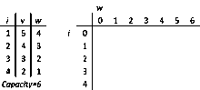

# Competitive-programming
Algoritmos e ideias de programação competitiva

~wallacelw, catiinfo

# Flags for compilation:

```bash
g++ -Wall -Wextra -Wshadow -ggdb3 -D_GLIBCXX_ASSERTIONS -fmax-errors=2 -std=c++17 -O3 test.cpp -o test
```

# Template

```cpp
#include <bits/stdc++.h>
#define ll long long
#define endl '\n'
#define sws ios_base::sync_with_stdio(false); std::cin.tie(0); std::cout.tie(0);
using namespace std;

// Optional, copy when having enough time
#define pb push_back
#define ld long double
#define vll vector<ll>
#define pll pair<ll, ll>
#define vpll vector<pll>
#define uset unordered_set
#define umap unordered_map
#define ff first
#define ss second
#define teto(a, b) ((a+b-1)/(b))
#define LSB(i) ((i) & -(i))

// need Long Long ?
// #define int long long

const int MAX = 3e5 + 10;
const ll LMAX = 1e9;
const ld LDMAX = 1e9+10;
const ll MOD = 1e9 + 7;
const int INF = 0x3f3f3f3f;
const ll LLINF = 0x3f3f3f3f3f3f3f3f;
const ld PI = acos(-1);
const long double EPS = 1e-7;

int32_t main(){sws;
    
}

// Check overflow, boarder cases, brute force possibility, psum? 
// Change approach
```

---

# Crivo de Eratóstenes

## Código:
```cpp
vector<int> crivo(int n){
    int max = 1e6;
    vector<int> primes {2};
    bitset<max> sieve;
    sieve.set();

    for(int i=3; i<=n; i+=2){
        if(sieve[i]){ // i is prime
            primes.push_back(i);

            for(int j= i*i; j<=n; j += 2*i) // sieving all odd multiples of i >= i*i
                sieve[j] = false;
        }
    }

    return primes;
}
```

---

# DP

## LIS ( Longest Increasing Sequence )

**Strictly Increasing**: ans_i < ans_(i+1)

**Requires** a vector *x* with size *n*

```cpp
vll d(n+1, LLINF);
d[0] = -LLINF;
for(ll i=0; i<n; i++){
    ll idx = upper_bound(d.begin(), d.end(), x[i]) - d.begin();
    if (d[idx-1] < x[i])
        d[idx] = min(d[idx], x[i]);
}
ll lis = (lower_bound(d.begin(), d.end(), LLINF) - d.begin() - 1);
```

---

## Knapsack



Use int instead of long long for 10^8 size matrix

```cpp
    int n; cin >> n; // quantity of items to be chosen
    int x; cin >> x; // maximum capacity or weight
    vector<int> cost(n+1);
    vector<int> value(n+1);
    for(int i=1; i<=n; i++) cin >> cost[i];
    for(int i=1; i<=n; i++) cin >> value[i];

    vector<vector<int>> dp(n+1, vector<int>(x+1, 0));

    for(int i=1; i<=n; i++){
        for(int j=1; j<=x; j++){
            // same answer as if using -1 total capacity (n pega)
            dp[i][j] = max(dp[i][j], dp[i-1][j]);
            // use the item with index i (pega)
            if (j-cost[i] >= 0)
                dp[i][j] = max(dp[i][j], dp[i-1][j-cost[i]] + value[i]);
        }
    }

    cout << dp[n][x] << endl;
```

---

# Disjoint Set Union

## Código:
```cpp
class DSU {
    public:
        vll group;
        vll card;
        DSU (long long n){
            group = vll(n);
            iota(group.begin(), group.end(), 0);
            card = vll(n, 1);
        }
        long long find(long long i){
            return (i == group[i]) ? i : (group[i] = find(group[i]));
        }
        void join(long long a ,long long b){
            a = find(a);
            b = find(b);
            if (a == b) return;
            if (card[a] < card[b]) swap(a, b);
            card[a] += card[b];
            group[b] = a;
        }
};
```

## Avisos

Possui a optimização de **Compressão** e **Balanceamento**

### Methods

#### O(a(N)) ~ O(1):

**find(i)**: finds the representative of an element and returns it


**join(a, b)**: finds both representatives and unites them, remaining only one for all. No return value

## Problems

---

# Geometry

## Point struct

### Código:
```cpp
struct point{
    int x, y;
    int ind;
 
    point operator -(const point& b) const{
        return point{x - b.x, y - b.y};
    }

    point operator +(const point& b) const{
        return point{x + b.x, y + b.y};
    }

    int operator *(const point& b) const{ // dot product
        return x*b.y + y*b.x;
    }
 
    int operator ^(const point& b) const{ // cross product
        return x*b.y - y*b.x;
    }

    int dot(const point& b, const point&c) const{ // dot product with diferent base
        return (b - *this) * (c - *this);
    }

    int cross(const point& b, const point&c) const{ // cross product with diferent base
        return (b - *this) ^ (c - *this);
    }
 
    bool operator <(const point& b) const{
        return make_pair(x,y) < make_pair(b.x,b.y);
    }

    bool operator ==(const point &o) const{
        return (x == o.x) and (y == o.y);
    }

};
```

## Convex Hull

**Complexity:** O(n * log (n))

### Código:
```cpp
struct point{
    int x, y;
    int ind;
 
    point operator -(const point& b) const{
        return point{x - b.x, y - b.y};
    }
 
    int operator ^(const point& b) const{ // cross product
        return x*b.y - y*b.x;
    }

    int cross(const point& b, const point&c) const{ // cross product with diferent base
        return (b - *this) ^ (c - *this);
    }
 
    bool operator <(const point& b) const{
        return make_pair(x,y) < make_pair(b.x,b.y);
    }

};
 
vector<point> convex_hull(vector<point>& v){
    vector<point> hull;
    sort(v.begin(), v.end());

    for(int rep=0; rep<2; rep++){
        int S = hull.size();
        for(point next : v){

            while(hull.size() - S >= 2){
                point prev = hull.end()[-2]; // hull[size - 2]
                point mid = hull.end()[-1]; // hull[size - 1]
                if(prev.cross(mid, next) <=0) // 0 collinear
                    break;
                hull.pop_back();
            }

            hull.push_back(next);
        }

        hull.pop_back();
        reverse(v.begin(), v.end());
    }
    return hull;
}
```

---

# Graph

## DFS (elegant code)

### Weighted Edges

```cpp
vector<vpll> g(MAX, vpll());

void dfs(ll u, ll p = -1){
    for(auto [v, w] : g[u]) if (v != p){
        dfs(v, u);
    }
}
```

## BFS

### Global scope

```cpp
queue<ll> fila;
bool visited[MAX];
ll d[MAX]; // distance

void bfs(){
    while(!fila.empty()){
        ll u = fila.front(); fila.pop();

        for(auto v : g[u]){
            if (visited[v]) continue;
            visited[v] = 1;
            d[v] = d[u] + 1;
            fila.push(v);
        }
    }
}
```

### Main scope

```cpp
memset(visited, 0, sizeof(visited));
memset(distance, -1, sizeof(distance));

d[1] = 0;
fila.push(1);
```

## Djikstra

```cpp
priority_queue<pll, vpll, greater<pll>> pq;
vector<vpll> g(MAX, vpll());
vll d(MAX, INF);

void dijkstra(ll start){
    pq.push({0, start});
    d[start] = 0;

    while( !pq.empty() ){
        ll u, p1; tie(p1, u) = pq.top(); pq.pop();
        if (p1 > d[u]) continue;
        for(auto elem : g[u]){
            ll v, p2; tie(v, p2) = elem;
            if (d[u] + p2 < d[v]){
                d[v] = d[u] + p2;
                pq.push({d[v], v});
            }
        }
    }
}
```

## DFS Tree

```cpp
bool visited[MAX];
vector<vll> g(MAX, vll());
map<ll, ll> spanEdges;
map<ll, ll> backEdges; // children to parent
ll h[MAX];
ll p[MAX];

void dfs(ll u=1, ll parent=0, ll layer=1){
    if (visited[u]) return;
    visited[u] = 1;
    h[u] = layer;
    for(auto v : g[u]){
        if (v == parent) spanEdges[u] = v;
        else if (visited[v] and h[v] < h[u]) backEdges[u] = v; 
        else dfs(v, u, layer+1);
    }
}
```

## Tree Transversal - Pre order (childs -> node) / "Euler Tour" / Preorder time / DFS time 

Created an array that can have some properties like all child vetices are right after the node

```cpp
vector<vector<int>> g(MAX, vector<int>());
int timer = 1; // to make a 1-indexed array
int st[MAX]; // L index
int en[MAX]; // R index

void dfs_time(int u, int p) {
	st[u] = timer++;
	for (int v : g[u]) if (v != p) {
        dfs_time(v, u);
	}
	en[u] = timer-1;
}
```

### Problems

https://cses.fi/problemset/task/1138 -> change value of node and calculate sum of the path to root of a tree

---

# Modular Arithmetic

## Basic operations with redundant MOD operators

```cpp
class OpMOD{
    public:
        long long add(long long a, long long b){
            return ( (a%MOD) + (b%MOD) ) % MOD;
        }
        long long sub(long long a, long long b){
            long long tmp = (a%MOD) - (b%MOD) % MOD;
            if (tmp < 0) tmp += MOD;
            return tmp;
        }
        long long mul(long long a, long long b){
            return ( (a%MOD) * (b%MOD) ) % MOD;
        }
        long long fast_exp(long long n, long long i){ // n ** i
            if (i == 0) return 1;
            if (i == 1) return n;
            long long tmp = fast_exp(n, i/2);
            if (i % 2 == 0) return mul(tmp, tmp);
            else return mul( mul(tmp, tmp), n );
        }
        long long inv(long long n){
            return fast_exp(n, MOD-2);
        }
        long long div(long long a, long long b){
            return mul(a, inv(b));
        }
};

```

## Faster operations and Factorials

It assumes that all numbers that are given are already between [0, MOD)

--> Probably works, xD. Careful with factorials function

```cpp
class OpMOD{
    public:
        long long add(long long a, long long b){
            return (a+b >= MOD) ? (a+b-MOD) : (a+b);
        }
        long long sub(long long a, long long b){
            return (a-b < 0) ? (a-b+MOD) : (a-b);
        }
        long long mul(long long a, long long b){
            return (a*b) % MOD;
        }
        long long fast_exp(long long n, long long i){ // n ** i;  O(log(i))
            long long ans = 1;
            while(i > 0){
                if (i & 1) ans = mul(ans, n);
                n = mul(n, n);
                i >>= 1; // i = floor(i / 2)
            }
            return ans;
        }
        long long inv(long long n){
            return fast_exp(n, MOD-2);
        }
        long long div(long long a, long long b){
            return mul(a, inv(b));
        }

        vector<long long> fact;

        void buildFact(long long n){ // from fact[0] to fact[n]; O(n)
            fact = vector<long long>(n+1);
            fact[0] = fact[1] = 1;
            for(long long i=2; i<=n; i++) fact[i] = mul(fact[i-1], i);
        }

        vector<long long> ifact;

        void buildIfact(long long n){ // from ifact[0] to ifact[n], requires FACT; O(n)
            ifact = vector<long long>(n+1);
            ifact[n] = inv(fact[n]);
            for(long long i=n-1; i>=0; i--) ifact[i] = mul(ifact[i+1], i+1);
        }
};
```

---

# Ordered Set

```cpp
// * Ordered Set and Map
// find_by_order(i) -> iterator to elem with index i; O(log(N))
// order_of_key(i) -> index of key; O(log(N))

#include <bits/extc++.h>
using namespace __gnu_pbds;
template <class T> using ordered_set = tree<T, null_type, less<T>, rb_tree_tag, tree_order_statistics_node_update>;
```
# Ordered Map
```cpp
// * Ordered Set and Map
// find_by_order(i) -> O(log(N))
// order_of_key(i) -> O(log(N))

#include <bits/extc++.h>
using namespace __gnu_pbds;
template <class K, class V> using ordered_map = tree<K, V, less<K>, rb_tree_tag, tree_order_statistics_node_update>;
```
## Avisos

Ordered Set pode ser tornar um multiset se utilizar um pair do valor com um index distinto. pll{val, t}, 1 <= t <= n


## Problemas

Consegue computar em O(log(N)), quantos elementos são menores que K, utilizando o index.

---

# Searching

## Binary search

### Código:
```cpp
bool attribute(int a){
    // add code here!!!!!
    return true;
}

int search(int l=0, int r=1e9, int ans=0){ 
    while(l <= r) { // [l; r]
        int mid = (l+r)/2;
 
        if(attribute(mid)) { // [mid; r]
            ans = mid;
            l = mid+1;
        }
        else { // [l; mid]
            r = mid-1;
        }
    }
    return ans;
}
```

### Problems

- Find an element in any monotonic function

## Ternary Search

**Complexity:** O( log(n) )

```cpp
ld f(ld d){
    // function here
}

ld ternary_search(ld l, ld r){ // for min value
    while(r - l > EPS){
        // divide into 3 equal parts and eliminate one side
        ld m1 = l + (r - l) / 3; 
        ld m2 = r - (r - l) / 3;

        if (f(m1) < f(m2)){
            r = m2;
        }
        else{
            l = m1;
        }
    }
    return f(l);
}
```

---

# Recursive Classic Segtree

Data structure that creates parent vertices for a linear array to do faster computation with binary agregation. 


## Código:
```cpp
int L = 1, N; // L = 1 = left limit; N = right limit
class SegmentTree {
    public:
        struct node{
            int psum;
        };

        node tree[4*MAX];
        int v[MAX];

        // requires minimum index and maximum index
        SegmentTree() {
            memset(v, 0, sizeof(v));
        }

        node merge(node a, node b){
            node tmp;
            // merge operaton:
            tmp.psum = a.psum + b.psum;
            //
            return tmp;
        }

        void build (int l=L, int r=N, int i=1) {
            if (l == r){
                node tmp;
                // leaf element
                tmp.psum = v[l];
                //
                tree[i] = tmp;
            }
            else{
                int mid = (l+r)/2;
                build(l, mid, 2*i);
                build(mid+1, r, 2*i+1);
                tree[i] = merge(tree[2*i], tree[2*i+1]);
            }
        }
        void point_update(int idx=1, int val=0, int l=L, int r=N, int i=1){
            if (l == r){
                // update operation to leaf
                node tmp{val};
                //
                tree[i] = tmp;
            }
            else{
                int mid = (l+r)/2;
                if (idx <= mid)
                    point_update(idx, val, l, mid, 2*i);
                else
                    point_update(idx, val, mid+1, r, 2*i+1);
                tree[i] = merge(tree[2*i], tree[2*i+1]);
            }
        }
        node range_query(int left=L, int right=N, int l=L, int r=N, int i=1){
            // left/right are the range limits for the update query
            // l / r are the variables used for the vertex limits
            if (right < l or r < left){
                // null element
                node tmp{0};
                //
                return tmp;
            }
            else if (left <= l and r <= right){
                return tree[i];
            }
            else{
                int mid = (l+r)/2;
                node ansl = range_query(left, right, l, mid, 2*i);
                node ansr = range_query(left, right, mid+1, r, 2*i+1);
                return merge(ansl, ansr);
            }
        }
};
```

## Avisos

### Details

**0 or 1-indexed**, depends on the arguments used as default value


Uses a **struct node** to define node/vertex properties. *Default:* psum 


Uses a **merge function** to define how to join nodes 


### Parameters

**left** and **right**: parameters that are the range limits for the range query 


**l** and **r**: are auxilary variables used for delimiting a vertex boundaries 


**idx**: index of the leaf node that will be updated 


**val**: value that will be inserted to the idx node 


### Atributes

**Tree**: node array 


**v**: vector that are used for leaf nodes 


### Methods

#### O(n):

**build(l, r, i)**: From **v** vector, constructs Segtree 

#### O(log(N))

**point_update(idx, l, r, i, val)**: updates leaf node with *idx* index to *val* value. No return value 


**range_query(left, right, l, r, i)**: does a range query from *left* to *right* (inclusive) and returns a node with the result 


### Requires
MAX variable 

## Problems

- Range Sum Query, point update
- Range Max/Min Query, point update
- Range Xor Query, point update

# Recursive Segtree with Lazy propagation

## Código:

```cpp
ll L=1, N; // L=1=left delimiter; N=right delimiter
class SegmentTreeLazy {
    public:
        struct node{
            int psum = 0;
        };

        node tree[4*MAX];
        int lazy[4*MAX];
        int v[MAX];

        node merge(node a, node b){
            node tmp;
            // merge operaton:
            tmp.psum = a.psum + b.psum;
            //
            return tmp;
        }
        
        SegmentTreeLazy() {
            memset(lazy, 0, sizeof(lazy));
            memset(v, 0, sizeof(v));
        }

        void build (int l=L, int r=N, int i=1) {
            if (l == r){
                node tmp;
                // leaf element
                tmp.psum = v[l];
                //
                tree[i] = tmp;
                lazy[i] = 0;
            }
            else{
                int mid = (l+r)/2;
                build(l, mid, 2*i);
                build(mid+1, r, 2*i+1);
                tree[i] = merge(tree[2*i], tree[2*i+1]);
                lazy[i] = 0;
            }
        }
        void range_update(int left=L, int right=N, int val=0, int l=L, int r=N, int i=1){
            // left/right are the range limits for the update query (can be chosen)
            // l / r are the variables used for the vertex limits
            if (lazy[i]){
                tree[i].psum += lazy[i] * (r-l+1);
                if (l != r){
                    lazy[2*i] += lazy[i];
                    lazy[2*i+1] += lazy[i];
                }
                lazy[i] = 0;
            }

            if (right < l or r < left) return;
            else if (left <= l and r <= right){
                tree[i].psum += val * (r-l+1);
                if (l != r){
                    lazy[2*i] += val;
                    lazy[2*i+1] += val;
                }
            }
            else{
                int mid = (l+r)/2;
                range_update(left, right, val, l, mid, 2*i);
                range_update(left, right, val, mid+1, r, 2*i+1);
                tree[i] = merge(tree[2*i], tree[2*i+1]);
            }
        }
        node range_query(int left=L, int right=N, int l=L, int r=N, int i=1){
            // left/right are the range limits for the update query
            // l / r are the variables used for the vertex limits
            if (lazy[i]){
                tree[i].psum += lazy[i] * (r-l+1);
                if (l != r){
                    lazy[2*i] += lazy[i];
                    lazy[2*i+1] += lazy[i];
                }
                lazy[i] = 0;
            }

            if (right < l or r < left){
                node tmp{0};
                return tmp;
            }
            else if (left <= l and r <= right){
                return tree[i];
            }
            else{
                int mid = (l+r)/2;
                node ansl = range_query(left, right, l, mid, 2*i);
                node ansr = range_query(left, right, mid+1, r, 2*i+1);
                return merge(ansl, ansr);
            }
        }
};
```

## Avisos

### Details

**0 or 1-indexed**, depends on the arguments passed on to the default variables 


Uses a **struct node** to define node/vertex properties. *Default:* psum 


Uses a **merge function** to define how to join nodes 


### Parameters

**left** and **right**: parameters that are the range limits for the range query 


**l** and **r**: are auxilary variables used for delimiting a vertex boundaries 


**idx**: index of the leaf node that will be updated 


**val**: value that will be inserted to the idx node 


### Atributes

**Tree**: node array 


**v**: vector that are used for leaf nodes 


**Lazy**: array containing lazy updates

### Methods

#### O(n):

**build(l, r, i)**: From **v** vector, constructs Segtree 

#### O(log(N))

**range_update(left, right, l, r, i, val)**: updates all element from *left* to *right* (inclusive) with *val* value. No return value 


**range_query(left, right, l, r, i)**: does a range query from *left* to *right* (inclusive) and returns a node with the result 


### Requires
MAX variable 

## Problems

- Range Sum Query, range update
- Range Max/Min Query, range update
- Range Xor Query, range update

# Iterative P-sum Classic Segtree with MOD

```cpp
struct Segtree{
    vector<ll> t;
    int n;
 
    Segtree(int n){
        this->n = n;
        t.assign(2*n, 0);
    }
 
    ll merge(ll a, ll b){
        return (a + b) % MOD;
    }
 
    void build(){
        for(int i=n-1; i>0; i--)
            t[i]=merge(t[i<<1], t[i<<1|1]);
    }
 
    ll query(int l, int r){ // [l, r]
        ll resl=0, resr=0;
        for(l+=n, r+=n+1; l<r; l>>=1, r>>=1){
            if(l&1) resl = merge(resl, t[l++]);
            if(r&1) resr = merge(t[--r], resr);
        }
        return merge(resl, resr);
    }
 
    void update(int p, ll value){
        p+=n;
        for(t[p]=(t[p] + value)%MOD; p >>= 1;)
            t[p] = merge(t[p<<1], t[p<<1|1]);
    }
 
};
```

# Segtree with sum, max, min

```cpp
#define int long long // need long long ? 
// !  Initialize N  !
int L = 1, N; // L = 1 = left limit; N = right limit
// 1 - indexed 
class SegmentTree {
    public:
        struct node{
            int psum, mx, mn;
        };

        node merge(node a, node b){
            node tmp;
            // merge operaton:
            tmp.psum = a.psum + b.psum;
            tmp.mx = max(a.mx, b.mx);
            tmp.mn = min(a.mn, b.mn);
            return tmp;
        }

        vector<node> tree;
        vector<int> v;

        SegmentTree() {
            v.assign(N+2, 0);
            tree.assign(N*4 + 10, node{0, 0, 0});
        }

        void build (int l=L, int r=N, int i=1) {
            if (l == r){
                // leaf element
                node tmp{v[l], v[l], v[l]};
                tree[i] = tmp;
            }
            else{
                int mid = (l+r)/2;
                build(l, mid, 2*i);
                build(mid+1, r, 2*i+1);
                tree[i] = merge(tree[2*i], tree[2*i+1]);
            }
        }

        void point_update(int idx=1, int val=0, int l=L, int r=N, int i=1){
            if (l == r){
                // update operation to leaf
                node tmp{val, val, val};
                tree[i] = tmp;
            }
            else{
                int mid = (l+r)/2;
                if (idx <= mid) point_update(idx, val, l, mid, 2*i);
                else point_update(idx, val, mid+1, r, 2*i+1);
                tree[i] = merge(tree[2*i], tree[2*i+1]);
            }
        }
        node range_query(int left=L, int right=N, int l=L, int r=N, int i=1){
            // left/right are the range limits for the update query
            // l / r are the variables used for the vertex limits
            if (right < l or r < left){ // out of bounds
                // null element
                node tmp{0, -INF, INF};
                return tmp;
            }
            else if (left <= l and r <= right){ // contained interval
                return tree[i];
            }
            else{ // partially contained
                int mid = (l+r)/2;
                node ansl = range_query(left, right, l, mid, 2*i);
                node ansr = range_query(left, right, mid+1, r, 2*i+1);
                return merge(ansl, ansr);
            }
        }
};
```

# Strings

## SUFFIX ARRAY

**Complexity:** O(n * log (n))

**Returns:** An array with size *n*, whose values are the indexes from the longest substring (0) to the smallest substring (n) after ordering it lexicographically. Example:

```
Let the given string be "banana".

0 banana                          5 a
1 anana     Sort the Suffixes     3 ana
2 nana      ---------------->     1 anana  
3 ana        alphabetically       0 banana  
4 na                              4 na   
5 a                               2 nana

So the suffix array for "banana" is {5, 3, 1, 0, 4, 2}
```

**Solves:** Finding the number of all distint substrings of a string. Done by adding all sizes of the substrings (size[i] = *total_size* - sa[i] ) and subtracting all lcp's.


```cpp
vector<int> suffix_array(string s) {
    s += "$";
    int n = s.size(), N = max(n, 260);
    vector<int> sa(n), ra(n);
    for (int i = 0; i < n; i++) sa[i] = i, ra[i] = s[i];
 
    for (int k = 0; k < n; k ? k *= 2 : k++) {
        vector<int> nsa(sa), nra(n), cnt(N);
 
        for (int i = 0; i < n; i++) nsa[i] = (nsa[i]-k+n)%n, cnt[ra[i]]++;
        for (int i = 1; i < N; i++) cnt[i] += cnt[i-1];
        for (int i = n-1; i+1; i--) sa[--cnt[ra[nsa[i]]]] = nsa[i];
 
        for (int i = 1, r = 0; i < n; i++) nra[sa[i]] = r += ra[sa[i]] !=
            ra[sa[i-1]] or ra[(sa[i]+k)%n] != ra[(sa[i-1]+k)%n];
        ra = nra;
        if (ra[sa[n-1]] == n-1) break;
    }
    return vector<int>(sa.begin()+1, sa.end());
}
```

## KASAI's ALGORITHM FOR LCP (longest common prefix)

**Complexity:** O(log (n))

**Returns:** An array of size *n* (like the suffix array), whose values indicates the lenght of the longest common prefix beetwen *sa[i]* and *sa[i+1]* 

```cpp
vector<int> kasai(string s, vector<int> sa) {
    int n = s.size(), k = 0;
    vector<int> ra(n), lcp(n);
    for (int i = 0; i < n; i++) ra[sa[i]] = i;
 
    for (int i = 0; i < n; i++, k -= !!k) {
        if (ra[i] == n-1) { k = 0; continue; }
        int j = sa[ra[i]+1];
        while (i+k < n and j+k < n and s[i+k] == s[j+k]) k++;
        lcp[ra[i]] = k;
    }
    return lcp;
}
```

# Z function

```cpp
vector<int> z_function(string s) {
    int n = (int) s.length();
    vector<int> z(n);
    for (int i = 1, l = 0, r = 0; i < n; ++i) {
        if (i <= r)
            z[i] = min (r - i + 1, z[i - l]);
        while (i + z[i] < n && s[z[i]] == s[i + z[i]])
            ++z[i];
        if (r < i + z[i] - 1)
            l = i, r = i + z[i] - 1;
    }
    return z;
}
```

**Solves:** Find occurrences of pattern string (*pattern*) in the main string (*str*):

```cpp
string str, pattern; cin >> str >> pattern;
string s = pattern + '$' + str;
vector<int> z = z_function(s);
ll ans = 0;
ll n = pattern.size();
for(ll i=0; i< (int) str.size(); i++){
    if( z[i + n + 1] == n)
        ans += 1;
}
cout << ans << endl;
```