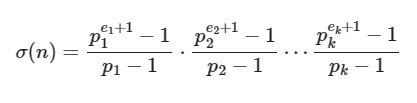

## Divisibility

    "a is divisible by b" or
    "a is a multiple of b" or
    "b is a divisor of a" or
    "b is a factor of a" or
    "b divides a" ( b|a )
    => a % b == 0

    "a1, a2 are divisible by b"
    => gcd(a1, a2) % b == 0

    "a is divisible by b1 and b2"
    => a % lcm(b1, b2) == 0


    "a is divisible by b and b is divisible by c" (lema 1 - transitivity)
    (a | b) , (b | c)  => a | c 

    lema2:
    (a | b) , (a | c) => a | (r*b + s*c)

    Euclides:
    a = b*q + r

    lema3:
    d = gcd(a, b) => gcd(a/d, b/d) = 1

    lema4:
    d = gcd(a, b) => d = r*a + s*b
    => (d0 | a) , (d0 | b) => d0 | d
    
    lema5:
    a | bc , gcd(a, b) = 1 => a | c

    lema6:
    a = b*q+r, 1 <= r < b
    => gcd(a, b) = gcd(b, r)

### Greatest Common Divisor (GCD) 

    gcd(a) = a
    gcd(a, b, c) = gcd( gcd(a, b), c ) 
    gcd(a, b) = (a*b) / lcm(a, b)

### Least Commom Multiple (LCM)

    lcm(a) = a
    lcm(a, b, c) = lcm( lcm(a, b), c ) 
    lcm(a, b) = (a*b) / gcd(a, b)

#### Observation

std-c++17 implements gcd() function, which works correcly for negative numbers as well.

**For negatives numbers, the following is true:**

    gcd(a,b) = gcd(−a,−b) = gcd(−a,b) = gcd(a,−b)


### Closed Formulas related to divisors of a number

Let **n** be a number represented by it's prime factors $p_i$ and respective exponents $e_i$:

**d(n) = k = t = number of divisors**





```cpp
long long SumOfDivisors(long long num) {
    long long total = 1;

    for (int i = 2; (long long)i * i <= num; i++) {
        if (num % i == 0) {
            int e = 0;
            do {
                e++;
                num /= i;
            } while (num % i == 0);

            long long sum = 0, pow = 1;
            do {
                sum += pow;
                pow *= i;
            } while (e-- > 0);
            total *= sum;
        }
    }
    if (num > 1) {
        total *= (1 + num);
    }
    return total;
}
```