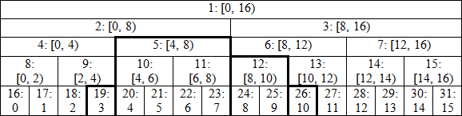

# Recursive Classic Segtree

Data structure that creates parent vertices for a linear array to do faster computation with binary agregation. 



## Clearer (min)

```cpp
// 1 indexed segtree for minimum
ll L=1, R;
struct Segtree {
    struct Node {
        ll mn;
    };
 
    vector<Node> tree;
    vll v;
    
    Segtree(ll n) {
        v.assign(n+1, 0);
        tree.assign(4*(n+1), Node{});
        R = n;
    }
 
    Node merge(Node a, Node b) {
        Node tmp;
        // merge operaton:
        tmp.mn = min(a.mn, b.mn);
        //
        return tmp;
    }
 
    void build( ll l=L, ll r=R, ll i=1 ) {
        if (l == r) {
            Node tmp;
            // leaf element:
            tmp.mn = v[l];
            //
            tree[i] = tmp;
        }
        else {
            ll mid = (l+r)/2;
            build(l, mid, 2*i);
            build(mid+1, r, 2*i+1);
            tree[i] = merge(tree[2*i], tree[2*i+1]);
        }
    }
 
    void point_update(ll idx=1, ll val=0, ll l=L, ll r=R, ll i=1 ) {
        if (l == r) {
            // update operation:
            Node tmp{val};
            //
            tree[i] = tmp;
        }
        else {
            ll mid = (l+r)/2;
            if (idx <= mid) point_update(idx, val, l, mid, 2*i);
            else point_update(idx, val, mid+1, r, 2*i+1);
            tree[i] = merge(tree[2*i], tree[2*i+1]);
        }
    }
 
    Node range_query(ll left=L, ll right=R, ll l=L, ll r=R, ll i=1) {
        // left/right are the range limits for the update query
            // l / r are the variables used for the vertex limits
            if (right < l or r < left){
                // null element
                Node tmp{INF};
                //
                return tmp;
            }
            else if (left <= l and r <= right) return tree[i]; 
            else{
                int mid = (l+r)/2;
                Node ansl = range_query(left, right, l, mid, 2*i);
                Node ansr = range_query(left, right, mid+1, r, 2*i+1);
                return merge(ansl, ansr);
            }
    }
};
```

## Old (sum):

```cpp
int L = 1, N; // L = 1 = left limit; N = right limit
class SegmentTree {
    public:
        struct node{
            int psum;
        };

        node tree[4*MAX];
        int v[MAX];

        // requires minimum index and maximum index
        SegmentTree() {
            memset(v, 0, sizeof(v));
        }

        node merge(node a, node b){
            node tmp;
            // merge operaton:
            tmp.psum = a.psum + b.psum;
            //
            return tmp;
        }

        void build (int l=L, int r=N, int i=1) {
            if (l == r){
                node tmp;
                // leaf element
                tmp.psum = v[l];
                //
                tree[i] = tmp;
            }
            else{
                int mid = (l+r)/2;
                build(l, mid, 2*i);
                build(mid+1, r, 2*i+1);
                tree[i] = merge(tree[2*i], tree[2*i+1]);
            }
        }
        void point_update(int idx=1, int val=0, int l=L, int r=N, int i=1){
            if (l == r){
                // update operation to leaf
                node tmp{val};
                //
                tree[i] = tmp;
            }
            else{
                int mid = (l+r)/2;
                if (idx <= mid)
                    point_update(idx, val, l, mid, 2*i);
                else
                    point_update(idx, val, mid+1, r, 2*i+1);
                tree[i] = merge(tree[2*i], tree[2*i+1]);
            }
        }
        node range_query(int left=L, int right=N, int l=L, int r=N, int i=1){
            // left/right are the range limits for the update query
            // l / r are the variables used for the vertex limits
            if (right < l or r < left){
                // null element
                node tmp{0};
                //
                return tmp;
            }
            else if (left <= l and r <= right){
                return tree[i];
            }
            else{
                int mid = (l+r)/2;
                node ansl = range_query(left, right, l, mid, 2*i);
                node ansr = range_query(left, right, mid+1, r, 2*i+1);
                return merge(ansl, ansr);
            }
        }
};
```

## Avisos

### Details

**0 or 1-indexed**, depends on the arguments used as default value


Uses a **struct node** to define node/vertex properties. *Default:* psum 


Uses a **merge function** to define how to join nodes 


### Parameters

**left** and **right**: parameters that are the range limits for the range query 


**l** and **r**: are auxilary variables used for delimiting a vertex boundaries 


**idx**: index of the leaf node that will be updated 


**val**: value that will be inserted to the idx node 


### Atributes

**Tree**: node array 


**v**: vector that are used for leaf nodes 


### Methods

#### O(n):

**build(l, r, i)**: From **v** vector, constructs Segtree 

#### O(log(N))

**point_update(idx, l, r, i, val)**: updates leaf node with *idx* index to *val* value. No return value 


**range_query(left, right, l, r, i)**: does a range query from *left* to *right* (inclusive) and returns a node with the result 


### Requires
MAX variable 

## Problems

- Range Sum Query, point update
- Range Max/Min Query, point update
- Range Xor Query, point update